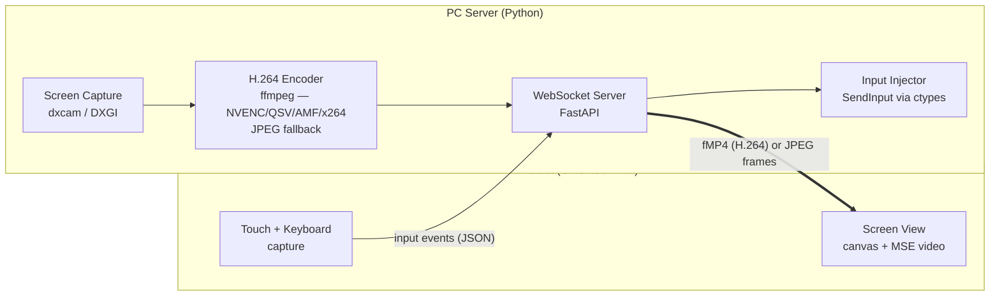

# Remote User

Control your Windows PC from an Android tablet or phone — see the screen, tap to click, type on the native keyboard. No app store, no cables, no cloud: the PC serves a web page, the tablet opens it, and everything stays on your local network.

## Table of Contents

- [Overview](#overview)
- [How It Works](#how-it-works)
- [Architecture](#architecture)
- [Design Decisions](#design-decisions)
- [Security Model](#security-model)
- [Remote Access](#remote-access)
- [Quick Start](#quick-start)
- [Project Structure](#project-structure)
- [Documentation](#documentation)

---

<a id="overview"></a>

## 🖥️ Overview

Remote User has two sides:

- **PC server (Python)** — captures the screen, streams it over the local network, and injects mouse/keyboard input it receives back.
- **Tablet client (web page / PWA)** — served by the PC itself and opened in Chrome on the Android device. Displays the live screen; touch gestures and the native soft keyboard are translated into input events. **Zero Android development** — the browser is the app.

Phase 1 delivers the most primitive remote loop: see the screen, tap to click, right-click via a floating icon, type text (e.g. an agent instruction into a VSCode text box), close an application. Later phases add per-application awareness — state tracking, notifications, and app-specific controls.

<a id="how-it-works"></a>

## 📡 How It Works

1. Start the PC app — it shows a **QR code** containing its LAN address and a pairing token.
2. Scan the QR code with the tablet camera — Chrome opens the client page.
3. The page connects over **WebSocket** and live screen frames start flowing.
4. **Tap** anywhere → the PC mouse moves to that exact position and left-clicks. Game-style corner buttons modify what your finger does while held: **RIGHT** (tap = right click), **DRAG** (finger = real mouse drag), **SCROLL** (finger = mouse wheel). Two fingers pinch-zoom the local view — and the server streams the zoomed region at native sharpness.
5. Tap the **⌨** button → the tablet's native keyboard opens and types into whatever is focused on the PC (full Unicode, emoji included). Tapping around the screen doesn't close it — click a field, keep typing.

One monitor is shown at a time; a switch button changes which monitor is displayed and controlled. The session lives only while you're looking at the page — backgrounding it or locking the tablet pauses control instantly.

<a id="architecture"></a>

## 🏗️ Architecture



**Input protocol (client → server, JSON):** `pointer_move`, `pointer_down`/`pointer_up` (with button), `scroll`, `key_text` (Unicode string), `key_special` (Enter, Backspace, arrows…), `monitor_switch`, `auth`.

**Frame channel (server → client, binary):** a live **H.264** stream as fragmented MP4, decoded by the browser via Media Source Extensions — one ffmpeg process per client, hardware-encoded when available (measured ~1.5 Mbps for a static screen vs ~37 Mbps as JPEG). When no encoder/ffmpeg exists, the server falls back to one JPEG per message. The PC pointer is not part of the frames — the server streams its position (`cursor` JSON) and the client draws a virtual cursor.

<a id="design-decisions"></a>

## 🧭 Design Decisions

| Decision | Choice | Why |
|----------|--------|-----|
| Client platform | Web page in Chrome (PWA) | Zero Android toolchain; iterate by refreshing the page. Proven by Weylus (Rust) using the same pattern |
| Screen capture | `dxcam` (DXGI Desktop Duplication) | Near-instant GPU-composited capture (~240fps capable), pip-installable |
| Streaming | **H.264 (fMP4 + MSE)**, hardware encoder auto-detected (NVENC → QuickSync → AMF → libx264), JPEG fallback | Inter-frame compression: ~25× less bandwidth than JPEG on a static screen; runs on any PC, and the JPEG path remains when ffmpeg is absent |
| Transport | Plain WebSocket on LAN | WebRTC's machinery (NAT traversal, adaptive bitrate) solves WAN problems we don't have |
| Input injection | Win32 `SendInput` via `ctypes` | Direct control; `KEYEVENTF_UNICODE` covers all scripts and emoji |
| Monitor handling | **One monitor per view**, explicit switch | Owner decision — eliminates mixed-DPI/multi-monitor coordinate math; client sends 0–1 coordinates within the displayed monitor only |
| Input mechanics | **Modifier buttons** (hold RIGHT/DRAG/SCROLL + finger), not timed gestures | Owner decision — zero ambiguity, no long-press tuning, never conflicts with pinch zoom |
| Sharp zoom | **Region streaming** (JPEG mode) — client reports its visible region, server crops before downscaling | Native-pixel sharpness when zoomed at constant bandwidth. Dropped on the H.264 path: inter-frame compression already makes the full frame cheap |
| Virtual cursor | Server streams `GetCursorPos`, client draws the arrow | DXGI capture never contains the pointer — without this you cannot see where the mouse is |
| Rejected: Kivy/BeeWare | — | Slow brittle APK builds, weak video and soft-keyboard support |
| Rejected (for now): Flutter | — | Only justified if background operation across tablet screen-lock ever becomes a requirement |

<a id="security-model"></a>

## 🔐 Security Model

- **No public internet exposure** — the server never opens a port to the public internet. On the LAN, only devices on the same Wi-Fi can reach it. For use away from home, see [Remote Access](#remote-access) — a private encrypted network, not an open port.
- **Token-gated input** — the WebSocket (and the `/upload` endpoint) accept nothing before a valid pairing token (delivered via QR code / account login) is presented. This is the lesson of Remote Mouse's unauthenticated-input CVEs.
- **Session only while watching** — the client closes the connection the moment the page is hidden (tab switch, screen lock) and reconnects when you return. The PC is never controllable while nobody is looking.
- **Known limitation:** UAC-elevated windows (admin Task Manager, installers, UAC prompts) silently ignore injected input unless the server itself runs elevated — a planned run-as-administrator option.

<a id="remote-access"></a>

## 🌍 Remote Access (away from home)

The server is LAN-only by design. To reach the PC from anywhere — another Wi-Fi, mobile data — **without** opening a port to the public internet, put both devices on a **Tailscale** (WireGuard) private mesh:

1. Install [Tailscale](https://tailscale.com/) on the PC and the phone, sign in to the same account on both (free for personal use).
2. Start the server as usual. If Tailscale is up, the pairing screen prints and encodes the **Tailscale URL** in the QR — scan it once; it works both at home and away.

This keeps the exact security model: end-to-end encrypted, no ports forwarded, and your screen is never relayed through a third-party cloud. Rejected alternatives: **port forwarding** (exposes the server publicly — the CVE class we avoid) and **cloud tunnels** (route your screen through someone else's server).

<a id="quick-start"></a>

## 🚀 Quick Start

**Installed app (the normal way):** run `RemoteUser_Setup.exe` (built by [Setup (folder)](setup/___setup.md)). The installer carries everything — bundled ffmpeg, a chain-installed Tailscale, the firewall rule — you never install a dependency by hand. Launch **Remote User**, scan the QR in the window with the phone camera, done. The app lives in the tray; closing the window keeps it running.

**Dev checkout (headless CLI):**

```
python -m venv .venv
.venv\Scripts\pip install -r requirements.txt
.venv\Scripts\python server\main.py        (or gui_main.py for the desktop window)
```

The CLI prints the pairing URL and a QR (console + image viewer). Dev note: H.264 wants `ffmpeg` on PATH — the server auto-detects a working encoder at startup and logs the choice; without ffmpeg it falls back to JPEG streaming automatically.

<a id="project-structure"></a>

## 📁 Project Structure

```
📁 Remote User/
  📝 README.md         ← You are here
  📝 ROADMAP.md        ← Development phases and status
  📝 CLAUDE.md         ← AI session guidance
  📝 ACTIONS.md        ← Owner-edited control categories (actions.json)
  ⚙️ requirements.txt
  ⚙️ actions.json
  📁 assets/
    🖼️ logo.svg
  📁 server/           ← Python PC server
    📝 ___server.md    ← Server documentation entry point
    🐍 gui_main.py     ← Desktop app entry (window + tray)
    🐍 main.py         ← Headless CLI entry
    🐍 bootstrap.py
    🐍 server_core.py
    🐍 config.py
    🐍 capture.py
    🐍 h264_streamer.py
    🐍 encoders.py
    🐍 input_injector.py
    🐍 web.py
    🐍 pairing.py
    🐍 monitors.py
    🐍 clipboard.py
    📁 gui/            ← PySide6 window, tray, theme
  📁 client/           ← Web client served to the tablet
    📝 ___client.md    ← Client documentation entry point
    📄 index.html
    📄 app.js
    📄 style.css
  📁 android/          ← Android app (native shell + WebView on the client)
    📝 ___android.md
  📁 setup/            ← Build pipeline (installer with bundled deps + APK)
    📝 ___setup.md
```

<a id="documentation"></a>

## 📚 Documentation

- [Roadmap](ROADMAP.md) — development phases, current status, future ideas
- [AI Guidance](CLAUDE.md) — architecture constraints and pitfalls for coding sessions
- [Server (folder)](server/___server.md) — PC-side components (core, GUI, streaming)
- [Client (folder)](client/___client.md) — tablet-side web client
- [Android (folder)](android/___android.md) — the phone app (shell around the client)
- [Setup (folder)](setup/___setup.md) — build pipeline, installer, APK
