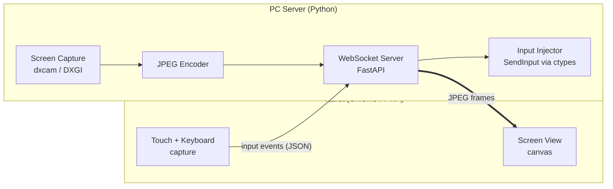

# Remote User

Control your Windows PC from an Android tablet or phone — see the screen, tap to click, type on the native keyboard. No app store, no cables, no cloud: the PC serves a web page, the tablet opens it, and everything stays on your local network.

## Table of Contents

- [Overview](#overview)
- [How It Works](#how-it-works)
- [Architecture](#architecture)
- [Design Decisions](#design-decisions)
- [Security Model](#security-model)
- [Quick Start](#quick-start)
- [Project Structure](#project-structure)
- [Documentation](#documentation)

---

<a id="overview"></a>

## 🖥️ Overview

Remote User has two sides:

- **PC server (Python)** — captures the screen, streams it over the local network, and injects mouse/keyboard input it receives back.
- **Tablet client (web page / PWA)** — served by the PC itself and opened in Chrome on the Android device. Displays the live screen; touch gestures and the native soft keyboard are translated into input events. **Zero Android development** — the browser is the app.

Phase 1 delivers the most primitive remote loop: see the screen, tap to click, right-click via a floating icon, type text (e.g. an agent instruction into a VSCode text box), close an application. Later phases add per-application awareness — state tracking, notifications, and app-specific controls.

<a id="how-it-works"></a>

## 📡 How It Works

1. Start the PC app — it shows a **QR code** containing its LAN address and a pairing token.
2. Scan the QR code with the tablet camera — Chrome opens the client page.
3. The page connects over **WebSocket** and live screen frames start flowing.
4. **Tap** anywhere → the PC mouse moves to that exact position and left-clicks. Game-style corner buttons modify what your finger does while held: **RIGHT** (tap = right click), **DRAG** (finger = real mouse drag), **SCROLL** (finger = mouse wheel). Two fingers pinch-zoom the local view — and the server streams the zoomed region at native sharpness.
5. Tap the keyboard icon → the tablet's native keyboard opens and types directly on the PC (full Unicode). *(Phase 2, in progress)*

One monitor is shown at a time; a switch button changes which monitor is displayed and controlled. The session lives only while you're looking at the page — backgrounding it or locking the tablet pauses control instantly.

<a id="architecture"></a>

## 🏗️ Architecture



**Input protocol (client → server, JSON):** `pointer_move`, `pointer_down`/`pointer_up` (with button), `scroll`, `key_text` (Unicode string), `key_special` (Enter, Backspace, arrows…), `monitor_switch`, `auth`.

**Frame channel (server → client, binary):** one JPEG per WebSocket message.

<a id="design-decisions"></a>

## 🧭 Design Decisions

| Decision | Choice | Why |
|----------|--------|-----|
| Client platform | Web page in Chrome (PWA) | Zero Android toolchain; iterate by refreshing the page. Proven by Weylus (Rust) using the same pattern |
| Screen capture | `dxcam` (DXGI Desktop Duplication) | Near-instant GPU-composited capture (~240fps capable), pip-installable |
| Streaming | JPEG-per-frame over WebSocket | No codec/container complexity, trivially debuggable; H.264+MSE is the documented upgrade path if bandwidth demands it |
| Transport | Plain WebSocket on LAN | WebRTC's machinery (NAT traversal, adaptive bitrate) solves WAN problems we don't have |
| Input injection | Win32 `SendInput` via `ctypes` | Direct control; `KEYEVENTF_UNICODE` covers all scripts and emoji |
| Monitor handling | **One monitor per view**, explicit switch | Owner decision — eliminates mixed-DPI/multi-monitor coordinate math; client sends 0–1 coordinates within the displayed monitor only |
| Input mechanics | **Modifier buttons** (hold RIGHT/DRAG/SCROLL + finger), not timed gestures | Owner decision — zero ambiguity, no long-press tuning, never conflicts with pinch zoom |
| Sharp zoom | **Region streaming** — client reports its visible region, server crops before downscaling | Native-pixel sharpness when zoomed at constant bandwidth; full 4K streaming would be ~216 Mbps |
| Rejected: Kivy/BeeWare | — | Slow brittle APK builds, weak video and soft-keyboard support |
| Rejected (for now): Flutter | — | Only justified if background operation across tablet screen-lock ever becomes a requirement |

<a id="security-model"></a>

## 🔐 Security Model

- **No internet communication** — the server binds to the LAN; only devices on the same Wi-Fi can reach it.
- **Token-gated input** — the WebSocket accepts no commands before a valid pairing token (delivered via QR code / account login) is presented. This is the lesson of Remote Mouse's unauthenticated-input CVEs.
- **Session only while watching** — the client closes the connection the moment the page is hidden (tab switch, screen lock) and reconnects when you return. The PC is never controllable while nobody is looking.
- **Known limitation:** UAC-elevated windows (admin Task Manager, installers, UAC prompts) silently ignore injected input unless the server itself runs elevated — a planned run-as-administrator option.

<a id="quick-start"></a>

## 🚀 Quick Start

```
python -m venv .venv
.venv\Scripts\pip install -r requirements.txt
.venv\Scripts\python server\main.py
```

The server prints the pairing URL, shows a QR code (console + image viewer), and starts streaming. Scan the QR with the tablet camera — Chrome opens the client and connects.

<a id="project-structure"></a>

## 📁 Project Structure

```
📁 Remote User/
  📝 README.md         ← You are here
  📝 ROADMAP.md        ← Development phases and status
  📝 CLAUDE.md         ← AI session guidance
  ⚙️ requirements.txt
  📁 assets/
    🖼️ logo.svg
  📁 server/           ← Python PC server
    📝 ___server.md    ← Server documentation entry point
    🐍 main.py
    🐍 config.py
    🐍 capture.py
    🐍 input_injector.py
    🐍 web.py
    🐍 pairing.py
  📁 client/           ← Web client served to the tablet
    📝 ___client.md    ← Client documentation entry point
    📄 index.html
    📄 app.js
    📄 style.css
```

<a id="documentation"></a>

## 📚 Documentation

- [Roadmap](ROADMAP.md) — development phases, current status, future ideas
- [AI Guidance](CLAUDE.md) — architecture constraints and pitfalls for coding sessions
- [Server (folder)](server/___server.md) — PC-side components
- [Client (folder)](client/___client.md) — tablet-side web client
