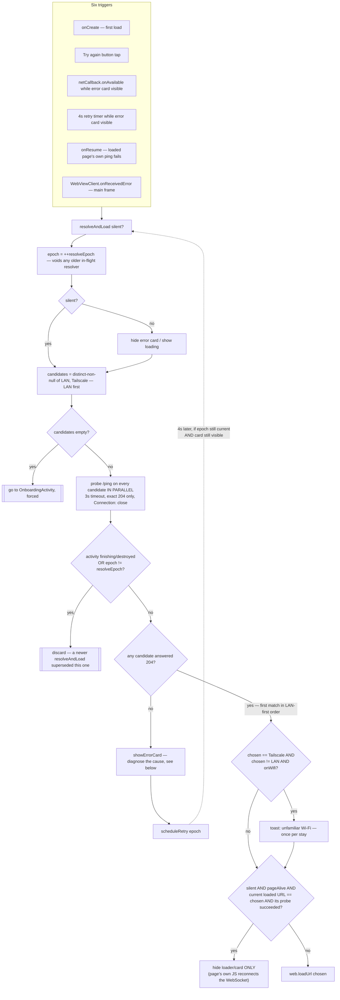

# Main Activity — Flow

**About:** [description](../__about/MainActivity.md)

## Algorithm — address resolution / failover

Six independent triggers all funnel into the same `resolveAndLoad`
routine — that convergence (instead of six ad-hoc handlers) is what makes
the error card self-healing instead of a dead end.



Pseudocode (language-neutral):

    FUNCTION resolveAndLoad(silent):
        epoch = ++resolveEpoch                 # any older in-flight resolver becomes stale
        IF NOT silent:
            hide error card, show "Connecting…" loader
        candidates = DISTINCT non-null [lanUrl, tailscaleUrl]   # LAN listed first = preferred
        IF candidates is empty:
            go to OnboardingActivity (forced re-pair); RETURN

        ON A BACKGROUND THREAD:
            FOR EACH candidate IN candidates, IN PARALLEL:
                result[candidate] = GET "<scheme>://<host>:<port>/ping"
                    WITH connectTimeout = readTimeout = 3s,
                         no redirects, no cache, header Connection: close
                    SUCCESS only if response code is EXACTLY 204
                    # a captive portal answers ANY request with its login page
                    # (2xx or a redirect) — anything but an exact 204 is "dead"
            WAIT for all results (bounded to ~2 * 3s + 500ms)
            chosen = first candidate, IN LIST ORDER, whose probe succeeded

            ON THE UI THREAD:
                IF activity is finishing/destroyed OR epoch != resolveEpoch:
                    DISCARD silently   # superseded by a newer resolveAndLoad call

                IF chosen is null:
                    hide loader, show error card
                    scheduleRetry(epoch)
                    RETURN

                IF chosen == tailscaleUrl AND chosen != lanUrl AND network is Wi-Fi:
                    warn "unfamiliar Wi-Fi" (toast, once per stay — re-armed when Wi-Fi drops)

                sessionHealthy = silent AND pageAlive AND
                                  (currently-loaded page URL == chosen) AND
                                  (chosen's own probe succeeded)
                IF sessionHealthy:
                    hide loader/card only        # the page's own JS reconnects the WebSocket;
                                                  # loadUrl here would tear down a live session
                ELSE:
                    web.loadUrl(chosen)           # loader/card stays until the page reacts

    FUNCTION scheduleRetry(epoch):
        postDelayed 4000ms:
            IF epoch == resolveEpoch AND activity alive AND error card still visible:
                resolveAndLoad(silent = true)
            # else: a newer call, a manual retry, or the card closing already voided this timer

## Algorithm — what the error card says (`classifyFailure`)

One generic "Try again" message covered five different causes (owner report
2026-08-04). The everyday one — phone away from the home Wi-Fi with Tailscale
switched off — is precisely the one where Try again can NEVER work and the
fix is two taps away in another app. The card is now rendered per cause, and
its primary button IS the fix.

```mermaid
flowchart TB
    IN[no stored address answered /ping] --> NET{active network with\nINTERNET capability?}
    NET -- no --> A["NO_NET — 'This phone has no internet'\nbutton: Try again"]
    NET -- yes --> TSURL{Prefs.tsUrl == null?\n(PC never reported a tunnel address)}
    TSURL -- yes --> B["PC_NO_TUNNEL — 'Turn Tailscale on — on the PC'\nbutton: Try again"]
    TSURL -- no --> INST{getLaunchIntentForPackage\ncom.tailscale.ipn == null?}
    INST -- yes --> C["TS_MISSING — 'One app is missing: Tailscale'\nbutton: Install Tailscale → Play Store"]
    INST -- no --> VPN{default network is a VPN?\nTRANSPORT_VPN or not NOT_VPN}
    VPN -- no --> D["TS_OFF — 'Tailscale is off'\nbutton: Turn Tailscale on → opens the app"]
    VPN -- yes --> E["PC_DOWN — 'Cannot reach the PC'\nbutton: Try again"]
```

The card is re-rendered on EVERY failed resolve, so it follows the phone's
state live: flip the tunnel on and the next 4 s round moves the text from
"Tailscale is off" to "the PC is not answering" — or, normally, loads the
session and the card disappears. Nothing here replaces the self-healing: the
network callback fires the moment the VPN comes up, so a user who turns
Tailscale on and switches back finds the session already loading — the
button exists to get them INTO Tailscale, not to reconnect.

Honest limits, both accepted deliberately:
- Android exposes no "is Tailscale connected" API — only "some VPN is up".
  Another VPN running with Tailscale off reads as `PC_DOWN`.
- Telling the home Wi-Fi from a foreign one would need the location
  permission just to read an SSID. So `TS_OFF` also catches "at home,
  Tailscale off, PC asleep" — its copy says exactly that, and turning the
  tunnel on is the only move the phone has in either case.
- Android gives no way to flip another app's VPN switch, so `openTailscale()`
  opens Tailscale and the card's text names the one control to press.
  Package visibility (`<queries>` in the manifest) is what makes the
  installed/not-installed distinction readable at all on Android 11+.

## Why the epoch counter exists

`resolveEpoch` is bumped by every call to `resolveAndLoad`, and both the
probe-result handler and `scheduleRetry`'s delayed callback check it before
acting. Without it, background probe threads and pending 4 s timers from an
*older* resolve attempt could apply their (possibly stale-by-now) verdict
after a newer attempt already loaded a different address — retries would
stack and could reload a page that a more recent resolve had just confirmed
healthy.

## Why `pageAlive` exists (the unlock race)

`pageAlive` is set by `WebViewClient.onPageFinished` (only when the load did
not fail) and cleared by `onPageStarted` / `onReceivedError`. It exists
because of a real audit finding (2026-07-29): at screen unlock, Wi-Fi takes
1–3 s to reassociate, so the `onResume` ping legitimately fails against a
perfectly healthy page whose own JavaScript has already reconnected its
WebSocket. Without `pageAlive`, the silent resolver would find *some*
address answering and call `loadUrl` on it — tearing down a session that
was never actually broken. The `sessionHealthy` check in the diagram above
is the fix: `loadUrl` only fires when the document is dead or its own
address stopped answering, never to "refresh" a page that is demonstrably
fine.
