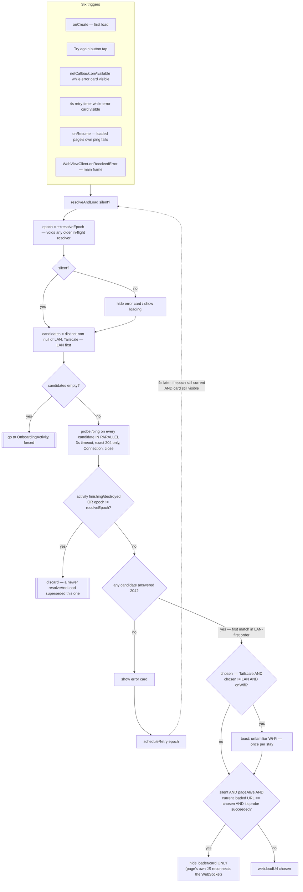

# Main Activity — Flow

**About:** [description](../__about/MainActivity.md)

## Algorithm — address resolution / failover

Six independent triggers all funnel into the same `resolveAndLoad`
routine — that convergence (instead of six ad-hoc handlers) is what makes
the error card self-healing instead of a dead end.

Pseudocode (language-neutral):

    FUNCTION resolveAndLoad(silent):
        epoch = ++resolveEpoch                 # any older in-flight resolver becomes stale
        IF NOT silent:
            hide error card, show "Connecting…" loader
        candidates = DISTINCT non-null [lanUrl, tailscaleUrl]   # LAN listed first = preferred
        IF candidates is empty:
            go to OnboardingActivity (forced re-pair); RETURN

        ON A BACKGROUND THREAD:
            FOR EACH candidate IN candidates, IN PARALLEL:
                result[candidate] = GET "<scheme>://<host>:<port>/ping"
                    WITH connectTimeout = readTimeout = 3s,
                         no redirects, no cache, header Connection: close
                    SUCCESS only if response code is EXACTLY 204
                    # a captive portal answers ANY request with its login page
                    # (2xx or a redirect) — anything but an exact 204 is "dead"
            WAIT for all results (bounded to ~2 * 3s + 500ms)
            chosen = first candidate, IN LIST ORDER, whose probe succeeded

            ON THE UI THREAD:
                IF activity is finishing/destroyed OR epoch != resolveEpoch:
                    DISCARD silently   # superseded by a newer resolveAndLoad call

                IF chosen is null:
                    hide loader, show error card
                    scheduleRetry(epoch)
                    RETURN

                IF chosen == tailscaleUrl AND chosen != lanUrl AND network is Wi-Fi:
                    warn "unfamiliar Wi-Fi" (toast, once per stay — re-armed when Wi-Fi drops)

                sessionHealthy = silent AND pageAlive AND
                                  (currently-loaded page URL == chosen) AND
                                  (chosen's own probe succeeded)
                IF sessionHealthy:
                    hide loader/card only        # the page's own JS reconnects the WebSocket;
                                                  # loadUrl here would tear down a live session
                ELSE:
                    web.loadUrl(chosen)           # loader/card stays until the page reacts

    FUNCTION scheduleRetry(epoch):
        postDelayed 4000ms:
            IF epoch == resolveEpoch AND activity alive AND error card still visible:
                resolveAndLoad(silent = true)
            # else: a newer call, a manual retry, or the card closing already voided this timer

## Why the epoch counter exists

`resolveEpoch` is bumped by every call to `resolveAndLoad`, and both the
probe-result handler and `scheduleRetry`'s delayed callback check it before
acting. Without it, background probe threads and pending 4 s timers from an
*older* resolve attempt could apply their (possibly stale-by-now) verdict
after a newer attempt already loaded a different address — retries would
stack and could reload a page that a more recent resolve had just confirmed
healthy.

## Why `pageAlive` exists (the unlock race)

`pageAlive` is set by `WebViewClient.onPageFinished` (only when the load did
not fail) and cleared by `onPageStarted` / `onReceivedError`. It exists
because of a real audit finding (2026-07-29): at screen unlock, Wi-Fi takes
1–3 s to reassociate, so the `onResume` ping legitimately fails against a
perfectly healthy page whose own JavaScript has already reconnected its
WebSocket. Without `pageAlive`, the silent resolver would find *some*
address answering and call `loadUrl` on it — tearing down a session that
was never actually broken. The `sessionHealthy` check in the diagram above
is the fix: `loadUrl` only fires when the document is dead or its own
address stopped answering, never to "refresh" a page that is demonstrably
fine.
