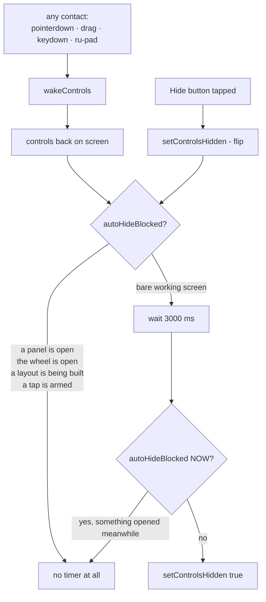

# Chrome — Flow

**About:** [description](../__about/chrome.md)

## Algorithm — when the controls get out of the way



The re-check is not belt-and-braces: three seconds is long enough for him to
have opened the sets picker after the last touch, and a card vanishing while he
reads it is exactly the behaviour that would make him switch this off.

## What "the bare working screen" is

The only state that may hide itself — his own definition:

```
┌───────────────────────────────────────────────┐
│ [Layout +]                          [Hide 👁] │
│                                               │
│                                               │
│                (the PC's screen)              │
│                                               │
│  ┌───────┐                         ┌───────┐  │
│  │ Click │                         │ Keys  │  │
│  │ Right │      two groups of      │ Enter │  │
│  │ Mouse │      four buttons       │ Input │  │
│  │ Middle│                         │ Esc   │  │
│  └───────┘                         └───────┘  │
└───────────────────────────────────────────────┘
```

Anything on top of that — a panel, the wheel, a creation session — holds the
controls until it is gone.

## The two writers, one state

```
Hide button ──┐
              ├──► setControlsHidden(bool) ──► body.hidden-controls
auto-hide  ───┘                            └─► hideBtn .active
```

The button and the timer are not two features that happen to agree. They are
one state with two doors, which is why neither writes the class directly.
