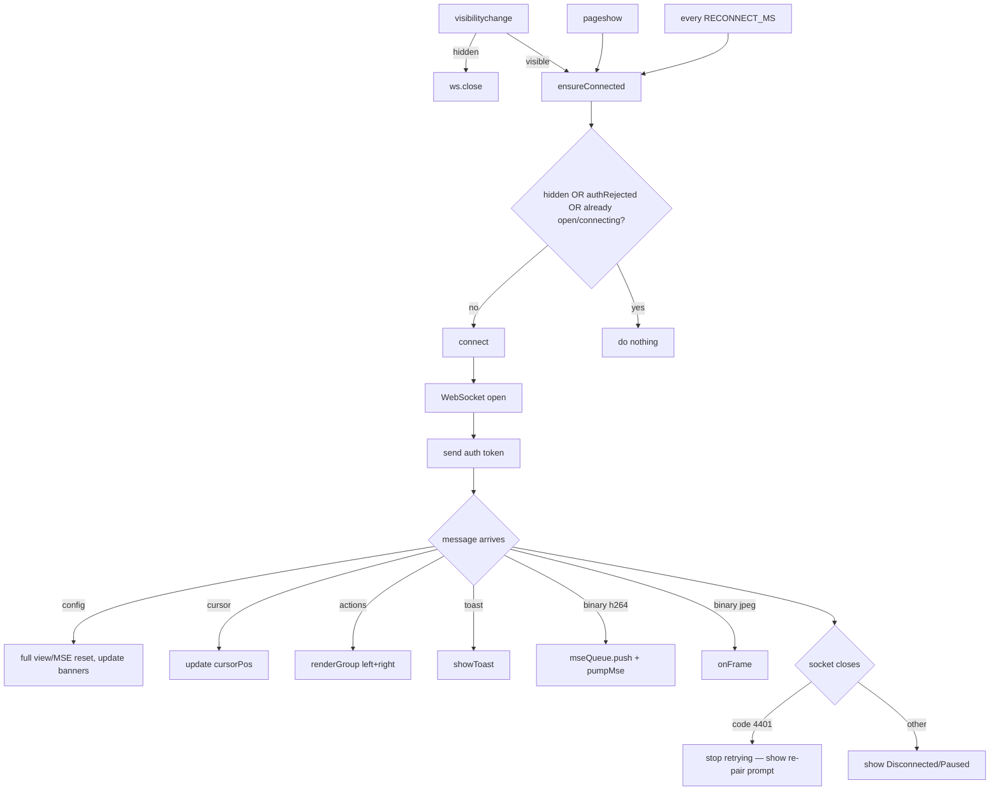

# Connection — Flow

**About:** [description](../__about/connection.md)

## Algorithm — connection lifecycle



Pseudocode:

    connect():
        sock = new WebSocket(...)
        ws = sock
        sock.onopen    → send({type: "auth", token})
        sock.onmessage → IF sock !== ws → ignore (stale socket)
                         ELSE dispatch by type (see About)
        sock.onclose   → IF sock !== ws → ignore (stale socket)
                         teardownMse()
                         IF code == 4401 → terminal state, no retry
                         ELSE → show disconnected/paused, rely on watchdog+visibility

    ensureConnected():
        IF page hidden OR token was rejected → RETURN
        IF ws already open or connecting → RETURN
        connect()

    ON visibilitychange:
        IF page hidden → ws.close()          # never controllable while unwatched
        ELSE → ensureConnected()             # instant reconnect, don't wait for watchdog

    setInterval(ensureConnected, RECONNECT_MS)   # safety net
    connect()                                     # initial call — page starts here

## Build round R3 (2026-08-07) — themes

```
msg.type === "config"
   |- monitor / streamMode / codec / tailscale_url / app_version
   |- setStreamBase(msg.base)
   |- applyUi(msg.ui)          <- R3: {theme, fill, colors}
   |     |- prefSet("uiLook")      the head start for the next page load
   |     |- <body data-theme/data-fill>
   |     `- refreshCategories()    the controls are already on screen
   `- ...view reset, MSE init, redraw
```
