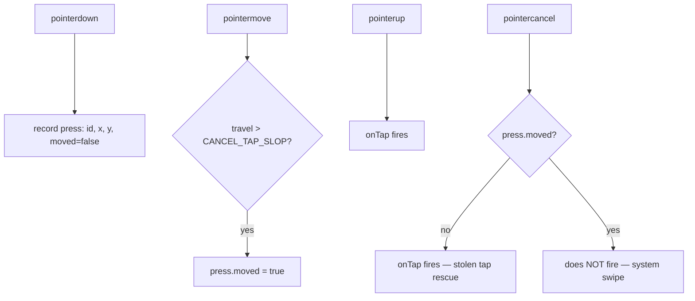

# Controls — Flow

**About:** [description](../__about/controls.md)

## Layout — on-screen zones this file owns

```
📱 viewport (index.html elements this file wires up)
  ⌨  #kb                — invisible full-width textarea (opacity:0), keyboard capture
  🌍 #anywhere-banner    — top banner, auto-shows once per device
  ⬆️  #update-banner      — top banner, shows only inside the APK when a newer PC build exists
  🧙 #wizard             — full-screen "access from anywhere" overlay (3-step guided setup)
  🔲 #group-left / #group-right  — D-pad crosses (landscape) / columns (portrait)
      ⚪ center button    — opens the category wheel for that side
      ⬆️⬅️➡️⬇️ up to 4 action buttons — from the current actions.json category
  🎡 #wheel              — category picker overlay (tap an item, ✕ or backdrop cancels)
  📌 #btn-pan (top-left) — Move: pan the local view, never clicks
  📌 #btn-hide (top-right) — Hide: collapses all controls, screen only
  📄 #filepick (hidden)  — phone → PC image upload input
  💬 #status             — the toast pill also reused for connection status
```

## Algorithm — button press dispatch (`keepFocus`)



Pseudocode:

    keepFocus(element, onTap):
        ON pointerdown  → preventDefault(); record { id, x, y, moved: false }
        ON pointermove  → IF travel from press origin > CANCEL_TAP_SLOP → moved = true
        ON pointerup    → preventDefault(); onTap() unconditionally; clear press
        ON pointercancel:
            IF press exists AND NOT moved → onTap()   # Android stole an edge tap — still fires
            ELSE → do nothing                          # real swipe crossed the button — never fires
            clear press

This is the single dispatch primitive every button in this file (mode
toggles, keyboard, wizard, update banner, upload, D-pad actions, wheel items,
corner buttons) is wired through — see
[tests/test_input_pipeline.py](../../tests/___tests.md) for the end-to-end
gate that locks both the stolen-tap and system-swipe cases in.

## Build round R3 (2026-08-07) — themes

```
refreshCategories()
   resetSetColors()                  <- R3: a new custom set may need a colour
   for side in (left, right):
       renderGroup(side)
          cat = allCats()[groups[side]]
          paintSet(host, cat.name)   <- --set-color/--set-ink/--set-glow
          ...buttons appended; they INHERIT the three properties

openWheel(side)
   for each cat: paintSet(item, cat.name)   <- the ring says what the colours are
```
