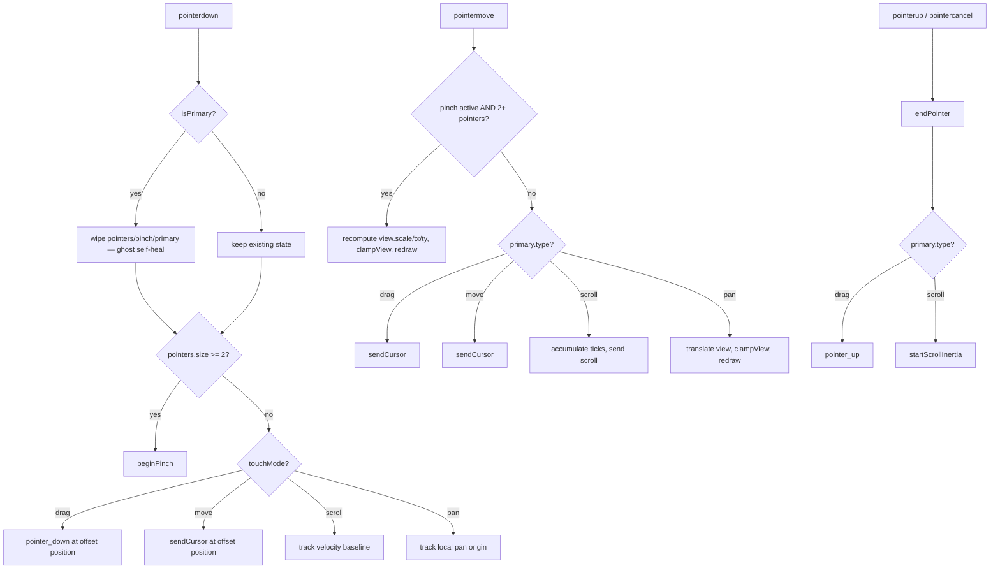

# Gestures — Flow

**About:** [description](../__about/gestures.md)

## Algorithm — pointer dispatch

Pseudocode:

    ON pointerdown:
        IF isPrimary → wipe pointers/pinch/primary (ghost-pointer self-heal)
        register this pointer; sampleFinger(e)
        IF 2+ pointers down → beginPinch(); RETURN
        primary = { id, type: touchMode, offset: isTouch }
        SWITCH touchMode:
            drag   → primary.pos = offset-mapped point; send pointer_down
            move   → sendCursor(offset-mapped point)
            scroll → prime velocity tracking at this point
            (pan handled entirely in pointermove via startX/startY)

    ON pointermove:
        IF pinch active AND 2+ pointers → rescale/translate view; RETURN
        IF not the primary pointer → RETURN
        SWITCH primary.type:
            drag/move → sendCursor(offset-mapped point)
            scroll    → accumulate delta-Y into tick counter; send scroll ticks
            pan       → translate view by finger delta; clampView; redraw

    ON pointerup / pointercancel → endPointer:
        remove this pointer; drop pinch if under 2 pointers
        IF this was the primary:
            IF type == drag   → send pointer_up
            IF type == scroll → startScrollInertia(lastVelocity)
            primary = null
