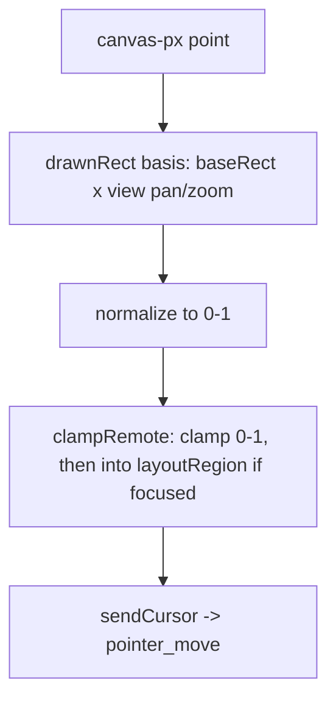

# Input Geometry — Flow

**About:** [description](../__about/input-geometry.md)

## Algorithm — coordinate mapping

Pseudocode:

    toRemoteClamped(px, py):
        D = drawnRect()
        x = (px - D.x) / D.w
        y = (py - D.y) / D.h
        RETURN clampRemote(x, y)

    clampRemote(x, y):
        x = clamp(x, 0, 1); y = clamp(y, 0, 1)
        IF a layout is focused:
            clamp further into layoutRegion
        RETURN {x, y}

    sendCursor(remote):
        cursorPos = remote           # optimistic draw
        send({type: "pointer_move", ...remote})
        redraw()

## The cursor-offset system is gone (owner 2026-08-02, remnants finished 2026-08-07)
This diagram used to show a calibration loop (locking `fingerRadiusPx` from
touch-contact samples) feeding a fixed diagonal offset (`hand == "left"` →
45°, `"right"` → 315°) that placed the PC cursor away from the finger. None of
that exists anymore — the mapping above is the whole algorithm. The owner
ordered every remaining trace removed on 2026-08-07 (the `calibrate` action,
`config.hand`, and this doc's stale description of dead functions), not kept
as legacy.
