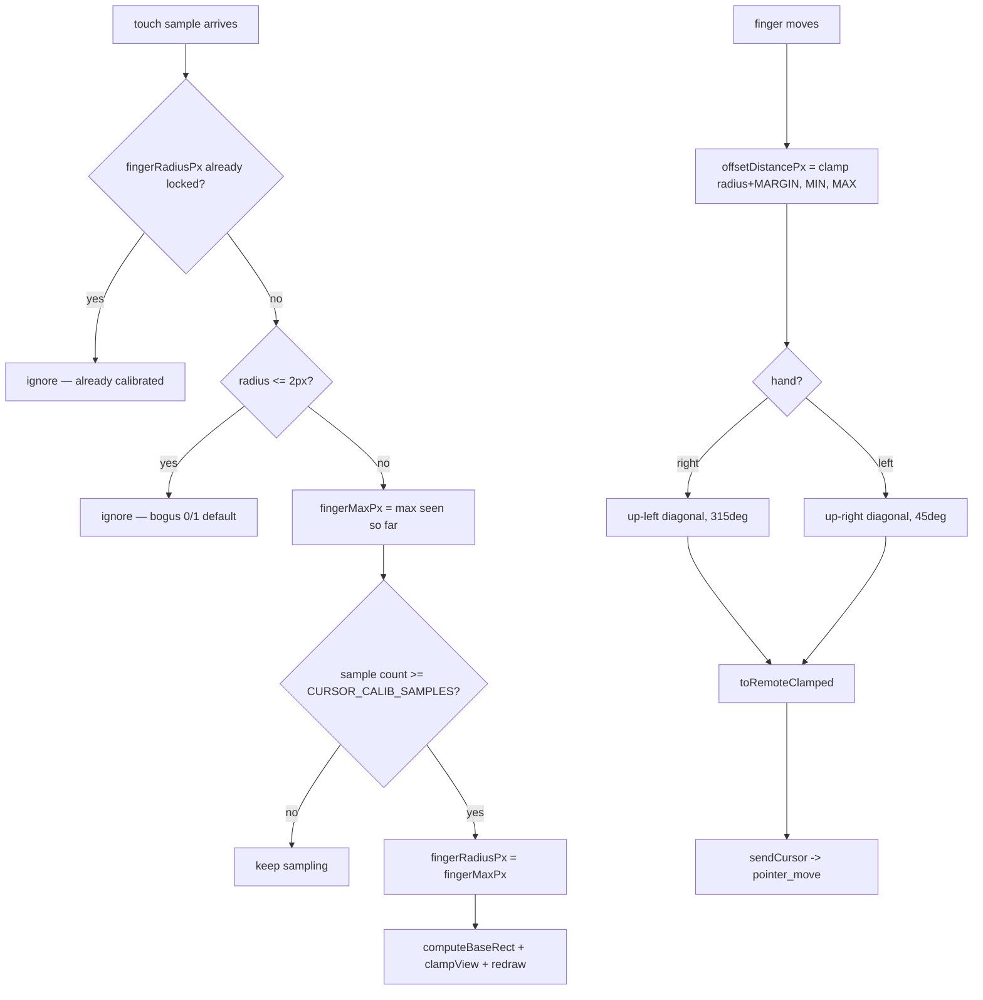

# Input Geometry — Flow

**About:** [description](../__about/input-geometry.md)

## Algorithm — cursor-offset calibration + coordinate mapping

Pseudocode:

    ON each touch sample (while not yet calibrated):
        IF contact radius <= 2px → ignore (bogus reading)
        fingerMaxPx = max(fingerMaxPx, radius)
        IF sample count reached CURSOR_CALIB_SAMPLES:
            fingerRadiusPx = fingerMaxPx   # lock for the session
            recompute edge margin, clamp view, redraw

    offsetDistancePx():
        base = fingerRadiusPx is unset ? FALLBACK : fingerRadiusPx + MARGIN
        RETURN clamp(base, MIN, MAX)

    offsetRemote(fingerPoint):
        d = offsetDistancePx() in canvas px
        dx = (hand == "left" ? +d : -d) * sqrt(1/2)
        dy = -d * sqrt(1/2)
        RETURN toRemoteClamped(fingerPoint + (dx, dy))

    toRemoteMaybeOffset(point, isTouch):
        RETURN isTouch ? offsetRemote(point) : toRemoteClamped(point)   # mouse/pen: no offset
