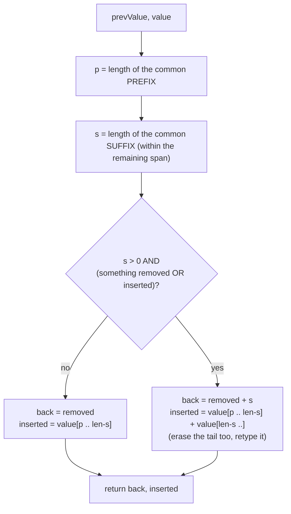
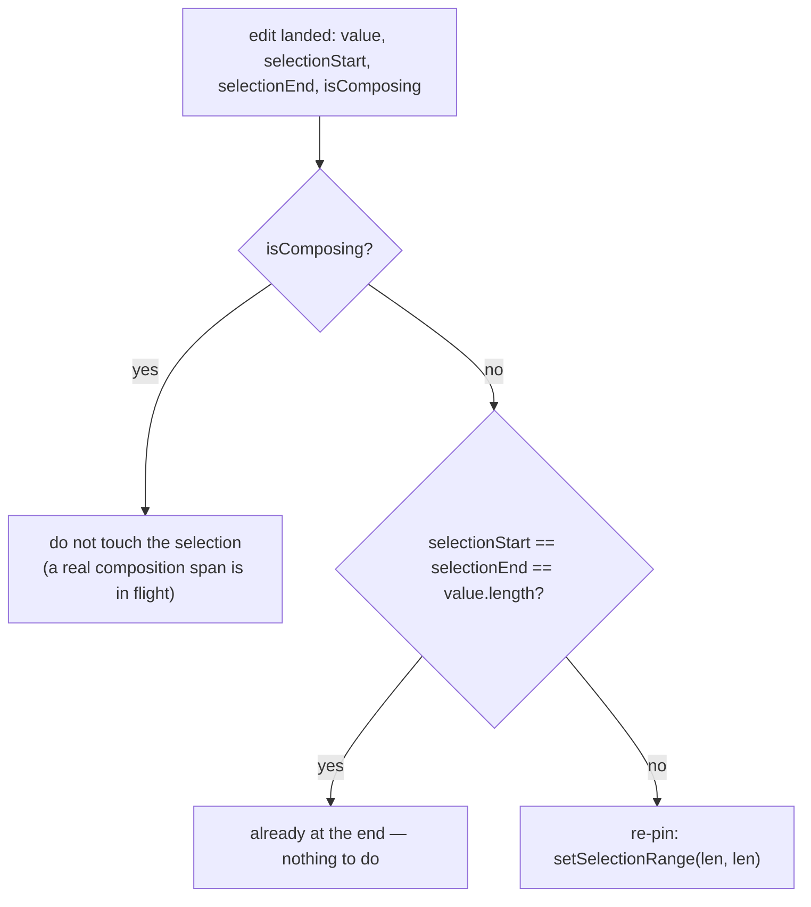

# Kb Sync — Flow

**About:** [description](../__about/kb-sync.md)

## Where one keystroke goes

```
kbInput `input` event fires (Android IME wrote into the invisible field)
   │
   ├─ kbDiff(kbPrev, value)  →  {back, inserted}
   │      back backspaces sent, then `inserted` typed (key_text / chord)
   │      kbPrev = value
   │
   └─ kbShouldRepin(value, selectionStart, selectionEnd, isComposing)
          │
          ├─ true  → kbInput.setSelectionRange(value.length, value.length)
          │           (the NEXT edit starts from the true end again)
          └─ false → leave the caret exactly where the IME put it
                      (mid-composition, or already at the end)
```

## Algorithm — `kbDiff`



The mid-string branch assumes the PC caret sits at the END of the mirrored
text — legitimate when an autocorrect rewrote a word further back in the
string while the phone's own caret stayed at the true end (the string's tail
is unchanged but must still be replayed after the edit, or it lands in the
wrong place on the PC). The SAME branch fires, wrongly, when the phone's own
caret is not really at the end at all — see `__about/kb-sync.md` for his
2026-08-13 report.

## Algorithm — `kbShouldRepin`



## Why re-pinning breaks the loop instead of only slowing it

| Tick | Field caret before | `kbDiff` sees | PC gets | Field caret after |
|------|--------------------|---------------|---------|--------------------|
| N (drift happens) | before "ok" (IME's doing, not his) | suffix "ok" unchanged | erase 2, retype his char + "ok" | re-pinned to end (this fix) |
| N+1 (his very next keystroke) | **at the end** | plain append | his char only | at the end |
| N+2, N+3, … | at the end | plain append | his chars only | at the end |

Without the re-pin, tick N+1's field caret is wherever the IME left it —
typically still before "ok" — so the suffix match repeats forever and every
tick after N re-sends "ok" to the PC, which is exactly his report: "no amount
of typing or deleting gets rid of it".
