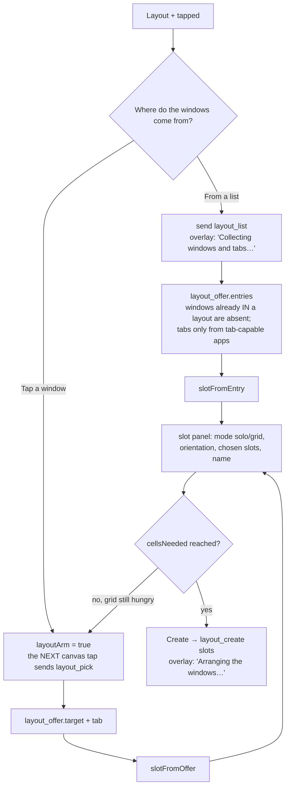

# Layout creation — Flow

**About:** [description](../__about/layout-create.md) ·
**Living with layouts:** [Layouts flow](layouts.md)

## Algorithm — the two sources, and the one slot shape they both produce



## The session, and every way it ends

```
creating = null                      nothing is being made
   │  + tapped
   ▼
creating = {source, slots: [], …}    the wizard is live, + is lit
   │
   ├── Create ─────────────► layout_create  →  creating = null
   ├── Cancel chip ────────► cancelCreation()      "Layout creation cancelled"
   ├── + tapped again ─────► cancelCreation()
   └── backdrop tap ───────► cancelCreation()   (layouts.js hands it over —
                                                 the list and aspect panels
                                                 just close, nothing was sent)
```

`cancelCreation` always clears `layoutArm` too. An armed tap that outlived its
session would turn the owner's next ordinary cursor move into a window pick.
