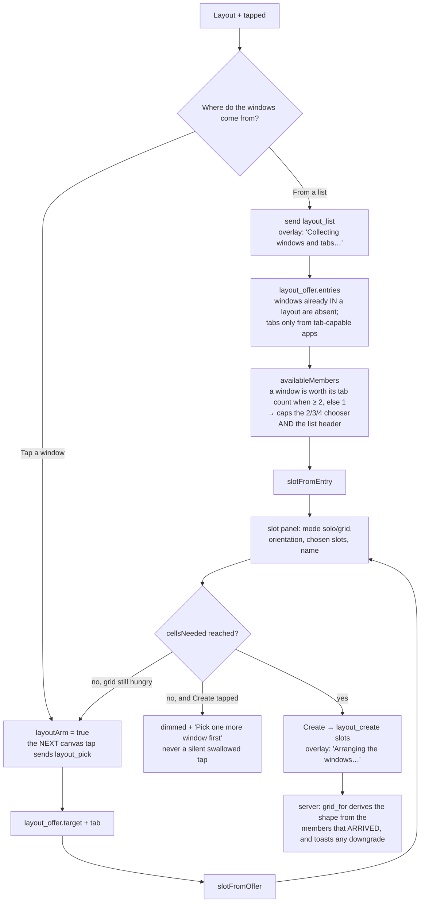

# Layout creation — Flow

**About:** [description](../__about/layout-create.md) ·
**Living with layouts:** [Layouts flow](layouts.md)

## Algorithm — the two sources, and the one slot shape they both produce



## How a row is drawn (owner 2026-08-09, task 168)

Both lists — Chosen, and Windows and tabs on the PC — are the SAME row, from
`entryRow`. A tab is a child of the window above it, and the drawing says so
with an indent instead of the old `"↳ "` prefix:

```
┌──────────────────────────────────────────────┐
│ [icon] Vibe Coder - Visual Studio Code      │   a WINDOW: app icon
├──────────────────────────────────────────────┤
│    ┌─────────────────────────────────────────┤
│    │ prompt.txt                              │   a TAB: indented by exactly
│    ├─────────────────────────────────────────┤   the icon column (20 + 10),
│    │ layout_api.py                           │   so its title lands under
│    └─────────────────────────────────────────┤   its parent's, no icon
├──────────────────────────────────────────────┤
│ [icon] Mail - Google Chrome     minimized    │   a window whose tabs cannot
└──────────────────────────────────────────────┘   be read while it is down
```

Every row is ONE LINE and the title is cut by CSS, never by JS (task 163's kin
rule; a JS cut is invisible to every clip test the audit has). The indent is
legal under that rule because a child is not in its parent's kin group — his
own ruling, and the reason rows were possible at all.

## The session, and every way it ends

```
creating = null                      nothing is being made
   │  + tapped
   ▼
creating = {source, slots: [], …}    the wizard is live, + is lit
   │
   ├── Create ─────────────► layout_create  →  creating = null
   ├── Cancel chip ────────► cancelCreation()      "Layout creation cancelled"
   ├── + tapped again ─────► cancelCreation()
   └── backdrop tap ───────► cancelCreation()   (layouts.js hands it over —
                                                 the list and aspect panels
                                                 just close, nothing was sent)
```

`cancelCreation` always clears `layoutArm` too. An armed tap that outlived its
session would turn the owner's next ordinary cursor move into a window pick.
