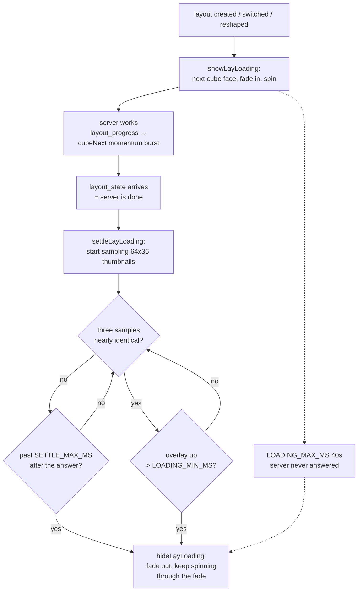
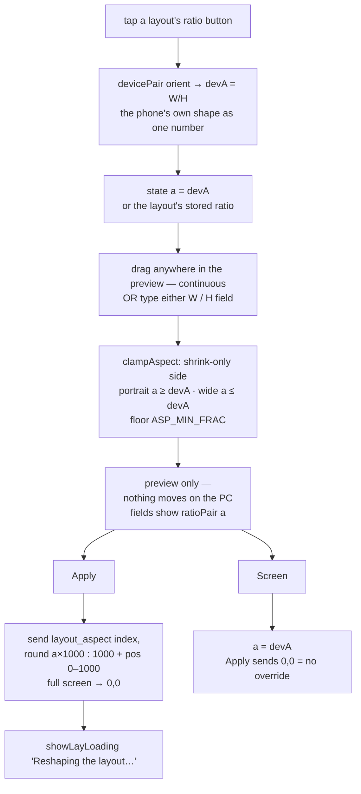
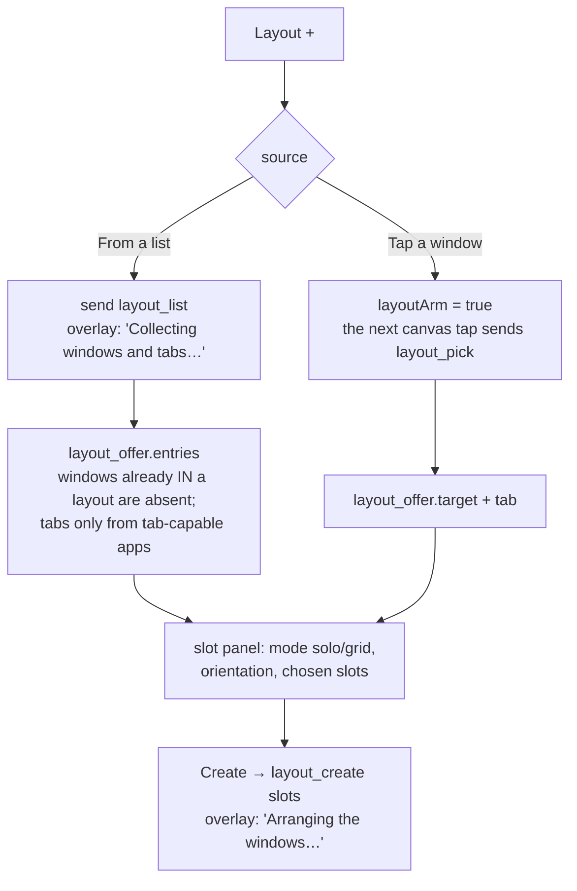

# Layouts — Flow

**About:** [description](../__about/layouts.md)

## Layout — the on-screen pieces this file owns

```
📱 viewport
  ┌───────────────────────────────────────────────────────────┐
  │ [+] #btn-newlay      #layout-bar            #btn-hide [👁] │
  │                 ⟨ ‹ ⟩ ┌──────────────┐ ⟨ › ⟩  ✕           │
  │                 SVG   │ 🗔  Chrome    │ SVG                │
  │                 32px  └──────────────┘                     │
  │                        tap → layout list                   │
  └───────────────────────────────────────────────────────────┘
  🗂 #layout-panel   — the ONE overlay card, three contents:
        · source chooser / creation panel   (creating ≠ null)
        · layout list (Desktop + every layout + its ratio button)
        · aspect panel (W : H + preview)    (aspecting ≠ null)
  🧊 #lay-loading    — opaque full-screen cube overlay (class `open`)
```

## Where a window's FULL title is readable

Three places show one, and each one shows it WHOLE — no character caps, no
ellipsis. A title is the only thing that tells two windows of one app apart.

```
creation panel                     layout list                  layout bar
┌───────────────────────────────┐  ┌───────────────────────┐   ┌──────────┐
│ Chosen (1/1) — tap to remove: │  │ 🗔 Claude Code -      │   │ 🗔 Claude│
│ ╭───────────────────────────╮ │  │    Remote User -      │   │ Code -   │
│ │ Claude Code - Remote User │ │  │    Visual Studio Code │   │ Remote…  │
│ │ - Visual Studio Code      │ │  │    [Administrator]    │   └──────────┘
│ │   [Administrator]         │ │  └───────────────────────┘   2 rows, then
│ ╰───────────────────────────╯ │  .lay-item-main span         clamped — the
│ Name:  ┌────────────────────┐ │  wraps, row grows            list is one
│        │ my own name here   │ │                              tap away
│        └────────────────────┘ │
└───────────────────────────────┘
  ▲ the chip is the DURABLE copy: the Name field may be retyped to
    anything, the chip above it still carries the window's own title
    (owner 2026-08-06 — "a pun naziv se na tom ekranu ne vidi nigde
    kada polje Name već prepišeš")
```

The chip and the list rows share ONE treatment (`.lay-title` /
`.lay-item-main span`: take the free width, then wrap). The top bar is the
single exemption in the project, written into `layouts.css` beside the rule:
it owns one row of the phone screen, and one tap opens the list.

## Algorithm — how long the loading animation lasts



Pseudocode:

    showLayLoading(text):
        cubeView = (cubeView + 1) % 6        # top → left → back → right → front → bottom
        cube tilt/angle = CUBE_VIEWS[cubeView]
        overlay.classList.add("open")        # CSS cross-fades in
        spin loop starts (rAF), backstop timer = LOADING_MAX_MS

    settleLayLoading():                      # called by the layout_state handler
        every SETTLE_SAMPLE_MS:
            draw the live frame source into a 64x36 canvas
            still = mean |Δrgb| vs the previous sample < SETTLE_DIFF
            hits = still ? hits + 1 : 0
            IF past the settle deadline OR (hits >= SETTLE_STABLE_HITS AND up > LOADING_MIN_MS):
                hideLayLoading()

## Algorithm — the aspect ratio panel



The rule the panel enforces, and the server enforces again
([Window Manager](../../server/__about/window_manager.md) → `layout_region`):
the region is the largest rect of the chosen W:H **inside** the box the
phone's own shape gives — it can only ever shrink, never grow past the screen.

    portrait:   width  = phone's width   (pinned)   height ≤ phone's height
    landscape:  height = phone's height  (pinned)   width  ≤ phone's width

`pos` (the Move handle) travels the same message but acts on the PHONE
(owner decree 2026-08-09): the server stores it, echoes it in `layout_state`,
and always centres the windows on the monitor; the picture is anchored by
[View Anchor](../__about/view-anchor.md) when the reply's `layout_state`
triggers `resetViewHome()`.

## Algorithm — creation sources


