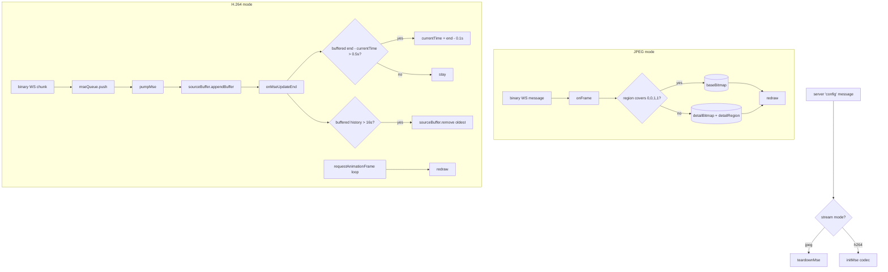

# Render — Flow

**About:** [description](../__about/render.md)

## Algorithm — frame pipeline by stream mode

Pseudocode:

    ON server 'config' message:
        IF stream mode == "h264" → initMse(codec)
        ELSE → teardownMse()
        reset view, bitmaps, cursor; computeBaseRect(); redraw()

    JPEG onFrame(buffer):
        region = first 4 floats (x, y, w, h)
        bitmap = decode remaining bytes
        IF region covers the full frame → replace baseBitmap
        ELSE → replace detailBitmap, remember detailRegion
        redraw()

    H.264 pumpMse (called after every queued chunk and after every append completes):
        IF sourceBuffer not updating AND queue not empty:
            appendBuffer(next chunk)   # errors close the socket, never freeze

    ON every MSE updateend:
        IF buffered end - currentTime > LIVE_MAX_BEHIND_S:
            jump currentTime to (end - LIVE_TARGET_BEHIND_S)   # catch up to live
        IF buffered history > 2 * BUFFER_KEEP_S:
            trim oldest history down to BUFFER_KEEP_S
        pumpMse()   # feed the next queued chunk, if any

    renderLoop (requestAnimationFrame, H.264 only):
        redraw() every frame while a stream is active

    redraw():
        clear canvas
        draw source pixels (video element OR base+detail bitmaps) into drawnRect()
        drawCursor()
