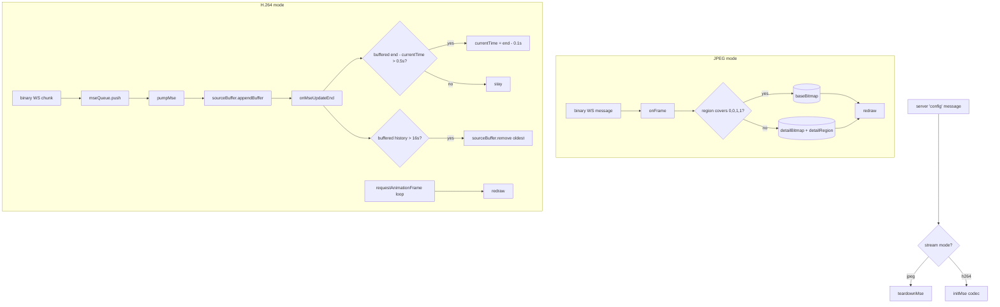

# Render — Flow

**About:** [description](../__about/render.md)

## Algorithm — frame pipeline by stream mode

Pseudocode:

    ON server 'config' message:
        IF stream mode == "h264" → initMse(codec)
        ELSE → teardownMse()
        reset view, bitmaps, cursor; computeBaseRect(); redraw()

    JPEG onFrame(buffer):
        region = first 4 floats (x, y, w, h)
        bitmap = decode remaining bytes
        IF region covers the full frame → replace baseBitmap
        ELSE → replace detailBitmap, remember detailRegion
        redraw()

    H.264 pumpMse (called after every queued chunk and after every append completes):
        IF sourceBuffer not updating AND queue not empty:
            appendBuffer(next chunk)   # errors close the socket, never freeze

    ON every MSE updateend (and on waiting/stalled + a 1s backstop tick):
        applyLiveDecision(behind, now):        # client/live-clock.js decides
            liveRegulate(...)  → playbackRate, and WHETHER a rescue seek is due
            liveCatchUp(...)   → whether the FORWARD catch-up may fire at all
                                 (task 216: the lateness must have survived
                                  LIVE_JUMP_HOLD_MS, and at most one jump per
                                  LIVE_JUMP_MIN_GAP_MS — every jump is a
                                  decoder flush, and his log counted 36 in 15s)
            perform at most ONE of the two seeks, via liveSeekTarget()
        IF buffered history > 2 * BUFFER_KEEP_S:
            trim oldest history down to BUFFER_KEEP_S
        pumpMse()   # feed the next queued chunk, if any

    renderLoop (requestAnimationFrame, H.264 only):
        redraw() every frame while a stream is active

    updateViewport()  (window/visualViewport resize + scroll, IME inset push):
        plan = liveResizePlan(current size, next size, everDrew)
        IF plan.preserve → kept = keepCanvasPixels()   # BEFORE anything clears
        IF plan.resize   → canvas.width/height = next  # this WIPES the buffer
        IF kept          → restoreCanvasPixels(kept)
        # a size that did not change is never assigned at all — assigning it
        # wipes the canvas to transparent black regardless (task 216)
        computeBaseRect(); computeViewHome(); clampView(); caret rise; redraw()

    redraw():
        IF liveHoldFrame(mode, readyState, seeking, everDrew) → return
             # nothing paintable: hold the last picture, SKIP THE CLEAR
        clear canvas
        draw source pixels (video element OR base+detail bitmaps) into drawnRect()
        drawCursor()

## The cursor-offset system is gone (owner 2026-08-02, remnants finished 2026-08-07)
The pointer sits exactly under the finger, the image aspect-fits the FULL
canvas, and a focused layout touches all four screen edges — no handedness
diagonal, no finger calibration, no reserved edge margin. Removed for good on
2026-08-07, along with `config.hand` and the `calibrate` action.
