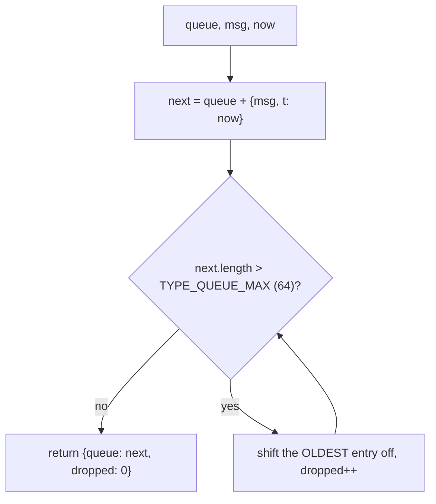
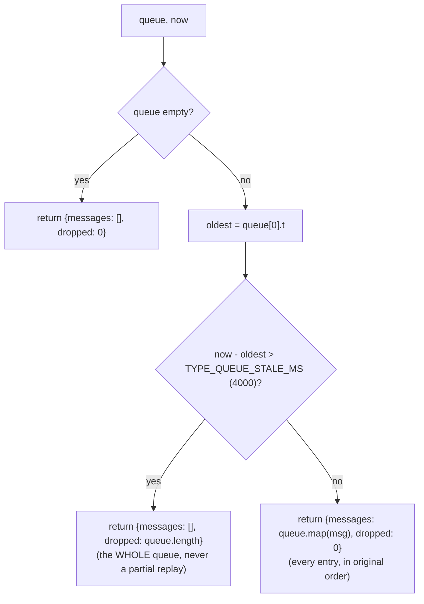

# Type Queue — Flow

**About:** [description](../__about/type-queue.md)

## Where one typing message goes when the socket is down

```
send(msg) called, ws is not OPEN
   │
   ├─ typeQueueKind(msg)?
   │      no  → old behaviour: setStatus("Reconnecting…"), ensureConnected()
   │      yes │
   │          ▼
   │      typeQueuePush(typeQueue, msg, now)  →  {queue, dropped}
   │          │
   │          ├─ dropped > 0 (cap overflow, oldest evicted)
   │          │      → noteTypeQueueLoss()  (toast + blur, ONCE per outage)
   │          └─ dropped == 0 → queued, waiting for reconnect
   │
   └─ setStatus("Reconnecting…"), ensureConnected()  (unchanged — the pill
      must still show SOMETHING is wrong, queued or not)

sock.onopen (connection.js), AFTER auth is sent
   │
   ▼
flushTypeQueue()
   │
   ├─ typeQueueFlush(typeQueue, now)  →  {messages, dropped}
   │      oldest entry stale (> TYPE_QUEUE_STALE_MS)?
   │          yes → messages = [], dropped = queue.length  (ALL abandoned)
   │          no  → messages = every queued msg, in order; dropped = 0
   │
   ├─ dropped > 0 → noteTypeQueueLoss()  (toast + blur)
   └─ dropped == 0 → messages.forEach(m => send(m))
                      (now ws IS open — each goes straight to ws.send)
```

## Algorithm — `typeQueuePush`



FIFO eviction: overflow drops the OLDEST messages first, so the survivors are
always the most RECENT keystrokes — the ones closest to whatever the owner
just did.

## Algorithm — `typeQueueFlush`



All-or-nothing on purpose: staleness is judged by the SINGLE oldest entry and
decides for the entire queue. A per-item filter would let some but not all of
one backspace-heavy edit through — the exact silent, confusing half-state
this module exists to end (see `__about/type-queue.md`).

## Why the giveup is told once, not per message

`noteTypeQueueLoss()` (state.js) is guarded by `typeQueueLossNotified` — a
rapid burst can overflow the cap several times in a row, or a flush can give
up on dozens of queued messages at once, and a toast per message would bury
the one fact worth telling him ("some typing wasn't sent") under a stack of
identical ones. The flag resets only on a SUCCESSFUL flush (`dropped === 0`),
so the next genuine outage can notify again.
