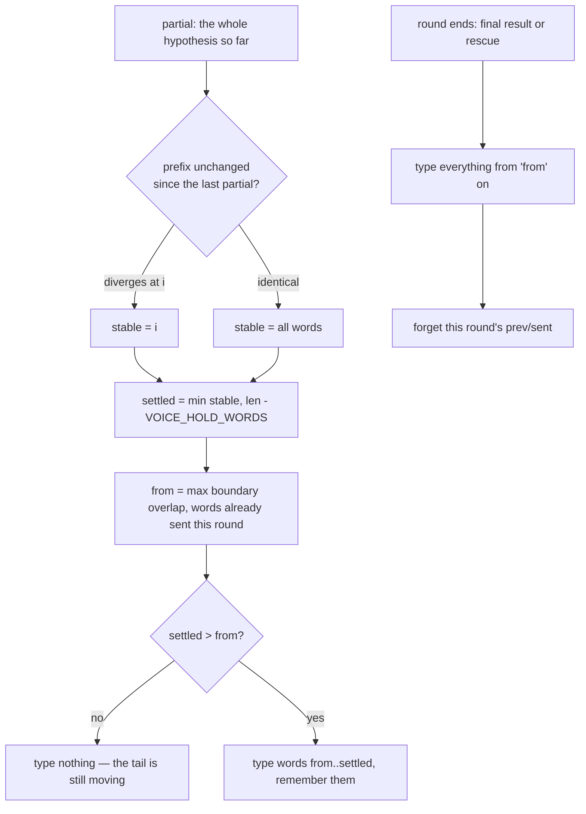

# Voice — Flow

**About:** [description](../__about/voice.md)

## Where the words come from

```
🎙 SpeechRecognizer (Android, another process)
   │ onPartialResults  ── every ~0.3 s while he speaks
   │     └─ VoiceInput.stream()  →  page: __voicePartial(text)  →  voiceStream()
   │ onResults (a final) / onError (the round died)
   │     └─ VoiceInput.deliver()  →  page: __voiceHeard(text, isFinal) → voiceDedup()
   └─ controls.js types whatever comes back:  sendTyped(out + " ")  →  key_text
```

## Algorithm — which words may be typed NOW



Pseudocode:

    voiceStream(raw):                       # a LIVE partial
        words   = split(raw)
        agreed  = length of the prefix identical to the previous partial
        settled = min(agreed, len(words) - VOICE_HOLD_WORDS)
        from    = max(overlap(voiceLastOut, words), voiceStreamSent)
        IF settled <= from → type nothing
        ELSE type words[from : settled]; voiceStreamSent = settled;
             remember them in voiceLastOut

    voiceDedup(raw, isFinal):               # the round ENDED — the flush
        from = max(overlap(voiceLastOut, words), voiceStreamSent)   # BEFORE the reset
        forget this round's prev/sent
        out  = words[from :]
        IF isFinal → voiceLastOut = ""      # the utterance is over
        ELSE       → remember out           # a rescue: the next round re-hears it

The two orderings that are load-bearing:

- `voiceDedup` reads `voiceStreamSent` **before** resetting it — that count is
  what stops a final whose head was revised (so the overlap finds nothing)
  from re-typing the whole utterance.
- `voiceStream` records the previous partial **before** returning early, so a
  partial that emits nothing still counts as a sighting for the next one.

## Worst case, in words

| Event | What reaches the PC | What is lost |
|-------|---------------------|--------------|
| He keeps talking | everything but the last 3 words, live | nothing |
| Round ends (silence, final) | + the held tail | nothing |
| Round dies (`ERROR_CLIENT`, network) | + the held tail, via the rescue | nothing |
| Next round re-hears the tail | nothing (trimmed) | nothing |
| **Phone rings / screen locks** | everything but the held tail | **≤ 3 words (~1.2 s)** + whatever audio the engine had not yet turned into a partial |

The last row is the one this feature exists for. It used to be the whole
monologue.
