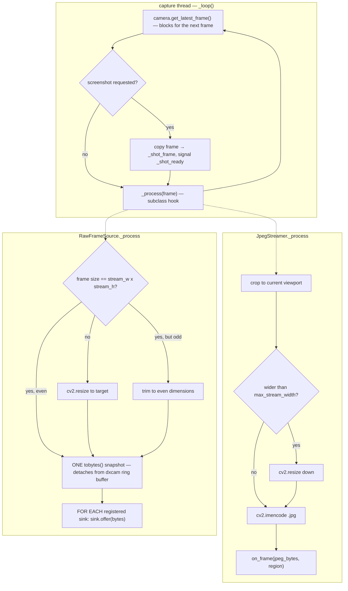

# Screen Capture — Flow

**About:** [description](../__about/capture.md)

## Algorithm

Pseudocode:

    _loop():                        # one thread per BaseCapture instance
        WHILE running:
            frame = camera.get_latest_frame()     # blocks until dxcam has a new one
            IF a screenshot was requested:
                _shot_frame = frame.copy()         # dxcam reuses its ring buffer
                signal _shot_ready
            _process(frame)                        # subclass-specific

    JpegStreamer._process(frame):
        frame, region = crop to self._viewport      # full frame if viewport is 0,0,1,1
        IF frame wider than max_stream_width → downscale (cv2.INTER_AREA)
        ok, jpeg = cv2.imencode(".jpg", frame, quality)
        IF not ok → log error, drop this frame
        on_frame(jpeg.tobytes(), region)

    RawFrameSource._process(frame):
        IF frame size != (stream_w, stream_h) → resize (or trim to even if only parity is off)
        data = frame.tobytes()          # the one copy per frame; immutable, shared
        FOR EACH sink in registered sinks:
            sink.offer(data)            # each sink keeps only the newest offer

    FrameSink.offer(data) / take(timeout):
        offer: store data, signal an event (overwrites whatever was not yet taken)
        take:  wait up to timeout for the event; return-and-clear the stored data, or None
