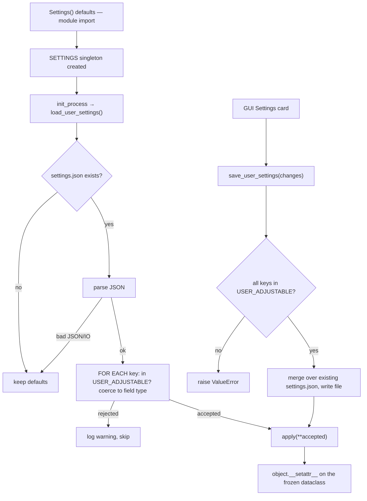

# Config — Flow

**About:** [description](../__about/config.md)

## Sections and Keys

```
⚙️ Settings (frozen dataclass, one instance: SETTINGS)
  📁 Network
    host, port ★
  📁 Streaming
    monitor_index ★, target_fps ★, jpeg_quality ★, max_stream_width
  📁 H.264 streaming
    use_h264 ★, ffmpeg_path, h264_encoder_order, h264_max_width ★,
    h264_bitrate ★, h264_gop, h264_fragment_us, h264_head_timeout, h264_queue_chunks
  📁 Virtual cursor
    cursor_hz
  📁 Injection self-check
    inject_verify_min_jump, inject_verify_tolerance, inject_verify_streak
  📁 Pairing
    token_bytes, persist_token, token_path
  📁 Remote access
    use_tunnel, cloudflared_path, cloudflared_url, tunnel_timeout,
    open_qr_image ★, qr_image_path
  📁 Logging
    log_dir, log_file, log_max_bytes, log_backups
  📁 Client files
    client_dir, favicon_path, apk_path
  📁 Action sets
    actions_path
  📁 Updates
    update_repo, update_check
    update_record_path, update_script_path, update_log_path
    update_wait_exit_s, update_wait_up_s
```

★ = in `USER_ADJUSTABLE` — the desktop GUI's Settings card may override these at
runtime; everything else is dev/build-time only.

## Load / apply / save



Pseudocode:

    load_user_settings():          # called once, after logging is set up
        IF settings.json missing → return (defaults stand)
        IF settings.json unreadable → log error, return (defaults stand)
        FOR EACH (key, value) in the file:
            IF key not in USER_ADJUSTABLE → log warning, skip
            coerced = _coerced(key, value)     # type-checked against the dataclass field
            IF coerced is None → skip (already logged)
            ELSE → accepted[key] = coerced
        IF accepted → apply(**accepted)

    save_user_settings(changes):   # the GUI's only write path
        IF any key not in USER_ADJUSTABLE → raise ValueError
        merge changes over the existing settings.json, write it
        apply(**changes)           # running SETTINGS updates immediately

## Build round R3 (2026-08-07) — themes; CORRECTED to three axes (2026-08-08)

```
Settings (dataclass)
   `- Appearance          ui_theme       "dark"          <- this PC
                          phone_theme    "dark"          <- the phone PAGE
                          phone_colored  False           <- the CONTROLS
                          phone_fill     "transparent"   <- the CONTROLS

SET_COLORS_DARK   (own banner section — 13 shipped sets, dark shades)
SET_COLORS_LIGHT  (the same 13, as strong inks for a light page)

set_colors(theme)  ->  phone_theme == "light" ? LIGHT : DARK   (never gated
                        on phone_colored — resolved regardless, cheap either
                        way, and it keeps this function answering ONE
                        question)
                        |
ui_config()  ->  {"theme":   phone_theme,
                  "colored": phone_colored,
                  "fill":    phone_fill,
                  "colors":  set_colors()}     <- already resolved: ONE flat
                                                   map on the wire, always
                        |
                        v
              web._send_config()  ->  `config` frame, key "ui"
                        |
                        v
     client/theme.js mergedUi() -> legacyTheme() translates a stray old-shape
                        |          `theme:"colored"/"colored-light"` FIRST
                        v          (server not yet rebuilt, or this device's
              applyUi()             OWN stale cache) into {theme, colored}
                        |
                        v
   <body data-theme=.. data-colored=.. data-fill=..>

BACKWARD COMPATIBILITY — settings.json written before 2026-08-08:
  _migrate_legacy_ui({"phone_theme": "colored-light", "phone_fill": "full"})
    -> {"phone_theme": "light", "phone_colored": True, "phone_fill": "full"}
  Runs on every load_user_settings() AND on save_user_settings()'s own
  re-read of the current file, so the file on disk self-heals on the very
  next save — the owner's saved choice is TRANSLATED, never reset to a
  default he never asked for.
```
