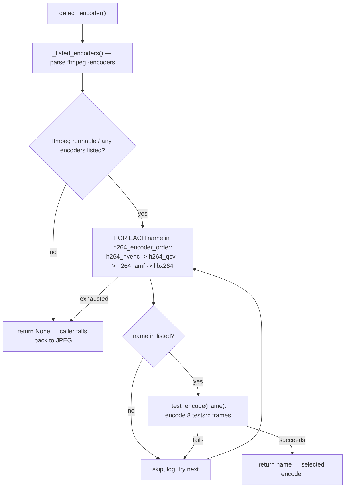

# Encoders — Flow

**About:** [description](../__about/encoders.md)

## Algorithm

Pseudocode:

    detect_encoder():
        listed = names from `ffmpeg -encoders` (empty if ffmpeg is not runnable)
        IF listed is empty → return None
        FOR EACH name IN h264_encoder_order:            # nvenc, qsv, amf, libx264
            IF name in listed AND _test_encode(name):
                log "Selected H.264 encoder: {name}"
                RETURN name
            log "Skipping {name} (not listed or failed test)"
        RETURN None                                     # caller uses JPEG instead

    _test_encode(name):
        RUN ffmpeg: encode 8 frames of a synthetic test pattern with `name` + its
                    low-latency args, output discarded (-f null -)
        RETURN True only if ffmpeg exits 0
