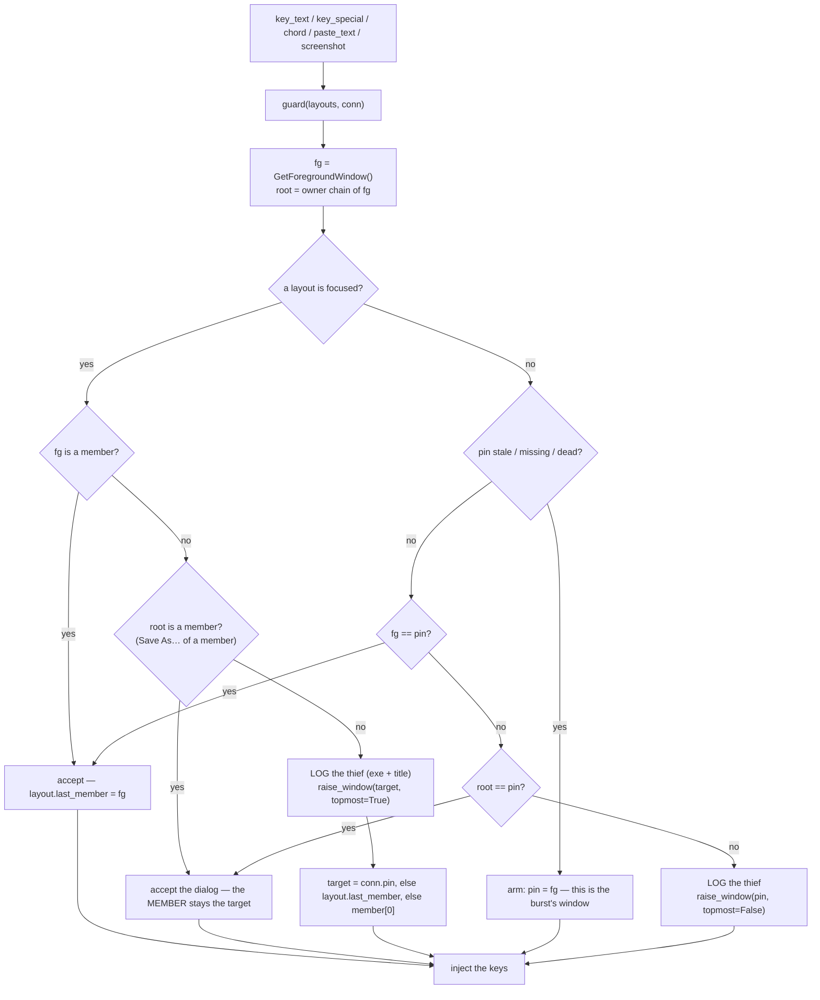
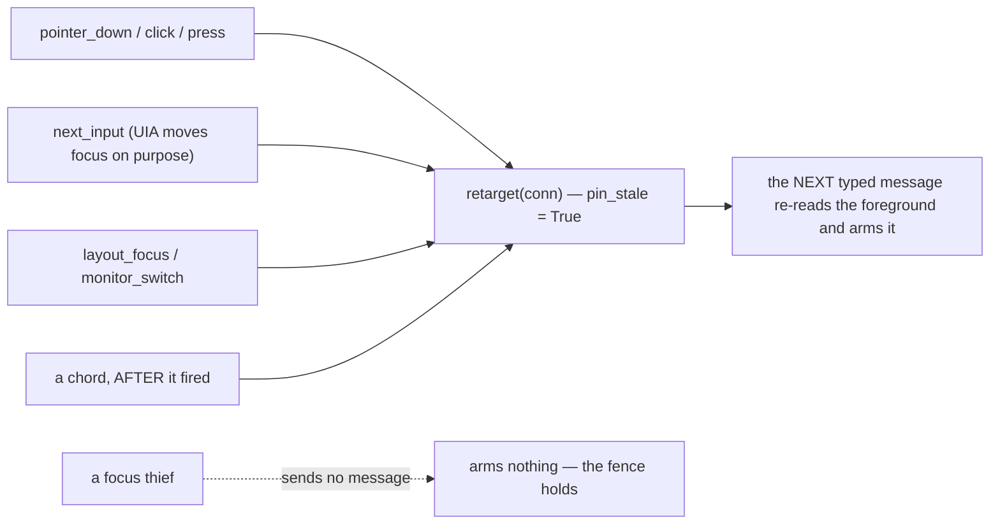
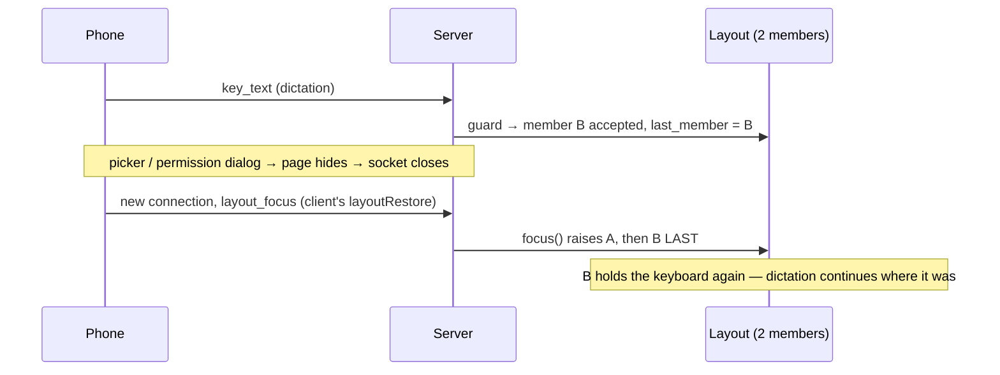
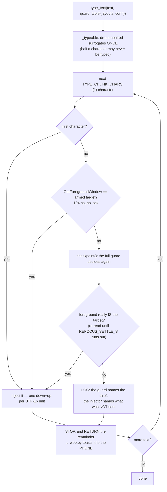
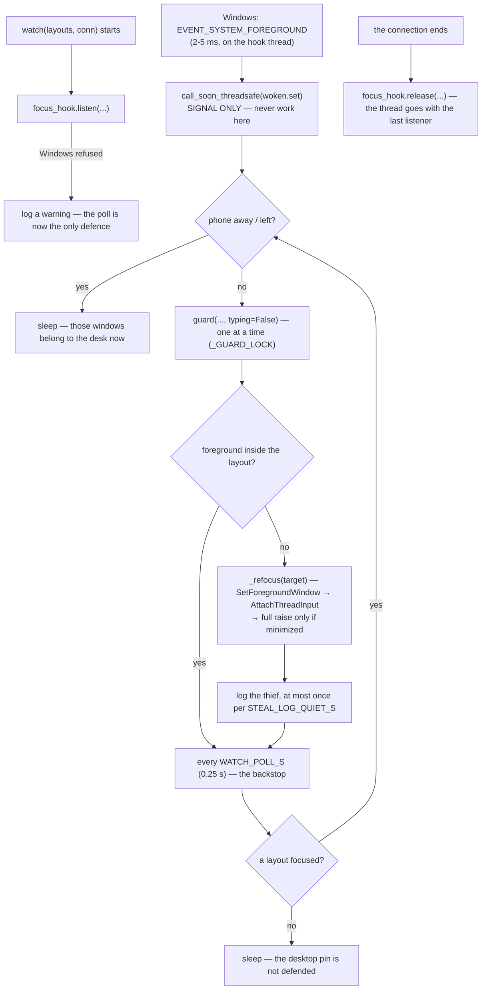

# Focus Guard — Flow

**About:** [description](../__about/focus_guard.md)

## Algorithm — every message that TYPES passes here first

`topmost=False` on the desktop path is not a detail: that window belongs to no
layout, and a topmost raise would strand it above the owner's desk for the rest
of the Windows session (owner decree 2026-08-05 — see
[Window Manager](../__about/window_manager.md)).

## Algorithm — what re-arms the target

A chord is guarded on the way IN (Ctrl+V must land in his box) and re-arms on
the way OUT: it may itself move the window — Alt+Tab, Win+arrow, Ctrl+W — and
the next keystroke must not drag focus back to where the chord just left. In a
LAYOUT the fence still wins: the phone shows those windows and no others.

## Algorithm — the keyboard member across an excursion

Before this, `focus()` raised members in list order, so the keyboard went to
whichever window sat last in the grid — one excursion moved the owner's
dictation into the other pane.

## Algorithm — INSIDE one typed message (build round R1)

Why a check per character: `SendInput` injects one code unit at a time, and it
was MEASURED on the owner's PC at 921 us per keyboard event — ~1.84 ms per
character, so a 600-character dictated sentence is ~1.1 s during which a window
that takes focus gets the REST of it, with nothing to replay it. The check is
194 ns: 0.01% of one character. The cut is by CHARACTER, so a surrogate pair is
never split across a boundary; the residual is that a steal landing between the
two halves of one pair lets the low half follow the high one out — one code
unit, never a whole character.

Why the restore is re-read rather than trusted: `SetForegroundWindow` returning
success is a REQUEST to the window manager, not a completed foreground change.

## Algorithm — the defence (one task per connection, two sources)

Why the poll and not the keystroke: a listening round delivers its text only
when it ENDS, so a thief that strikes mid-sentence takes the window half an
hour of speech was meant for. A defence that waits for a key arrives after the
damage. Why the hook AND the poll: the hook makes it milliseconds, the poll
makes it certain — Windows can refuse a hook, and drops one whose thread stops
pumping (`_log_silent_hook` reports that, once, when the poll has to undo a
change the hook never announced).

Why the callback only signals: it runs inside Windows' own event dispatch, and
calling `guard` there was measured stalling a second caller for 2.99 s — the
lock is held across a raise that waits for a frame to settle. See
[Focus Hook](../__about/focus_hook.md).

## Gate
Two gates, both fail-closed in [build.py](../../setup/build.py) step 0e and
both full-run checks in `tests/run_guards.py`. They were split on 2026-08-07
when together they crossed THE STRUCTURE LAW's 1,000 lines, and neither touches
the owner's desktop — no hook is installed, no window raised, no key injected
(`tests/_focus_fakes.py`).

- `tests/test_focus_guard.py` — the POLICY (16 checks): the fence, the
  fresh-connection case, the followed move, the dialog, the desktop pin, what
  re-arms it, the named thief, the raise order, the prune, the whole path
  through the real `web._receive_input` dispatcher, a steal at EIGHT different
  offsets in a sentence losing nothing, a steal inside an emoji costing at most
  its tail, typing that stops and says so, the PHONE being told what was lost,
  and half a character never going out.
- `tests/test_focus_hook.py` — the MACHINERY (9 checks): the instant defence,
  the callback that only signals (and the log when it does not), a hook that
  went quiet, the poll surviving a refused hook, the thread's start / stop /
  unhook / restart, a timed-out stop that keeps its identity instead of
  orphaning the thread, every documented exit path really calling the funnel
  (parsed, not grepped), and two threads never deciding at once.
