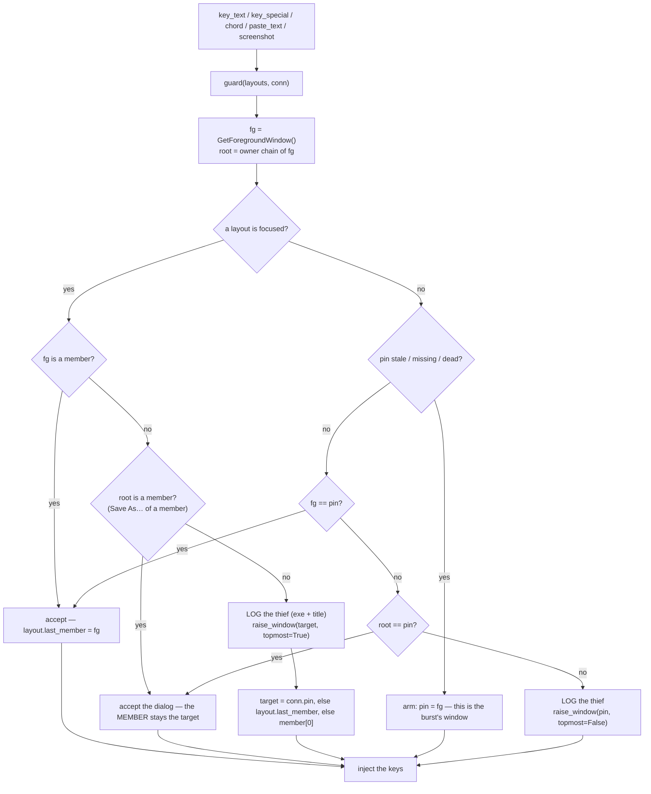
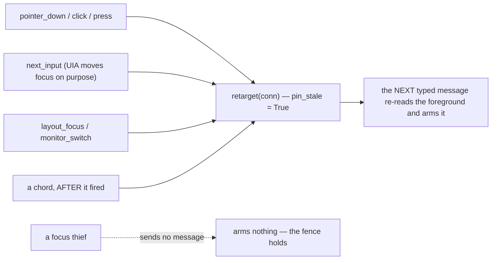
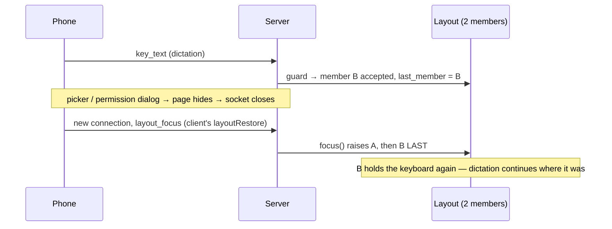

# Focus Guard — Flow

**About:** [description](../__about/focus_guard.md)

## Algorithm — every message that TYPES passes here first

`topmost=False` on the desktop path is not a detail: that window belongs to no
layout, and a topmost raise would strand it above the owner's desk for the rest
of the Windows session (owner decree 2026-08-05 — see
[Window Manager](../__about/window_manager.md)).

## Algorithm — what re-arms the target

A chord is guarded on the way IN (Ctrl+V must land in his box) and re-arms on
the way OUT: it may itself move the window — Alt+Tab, Win+arrow, Ctrl+W — and
the next keystroke must not drag focus back to where the chord just left. In a
LAYOUT the fence still wins: the phone shows those windows and no others.

## Algorithm — the keyboard member across an excursion

Before this, `focus()` raised members in list order, so the keyboard went to
whichever window sat last in the grid — one excursion moved the owner's
dictation into the other pane.

## Gate
`tests/test_focus_guard.py` (FOCUS GATE, step 0e of [build.py](../../setup/build.py)) —
11 checks, no Windows and no browser: the fence, the fresh-connection case,
the followed move, the dialog, the desktop pin, what re-arms it, the named
thief, the raise order, the prune, and the whole path through the real
`web._receive_input` dispatcher.
