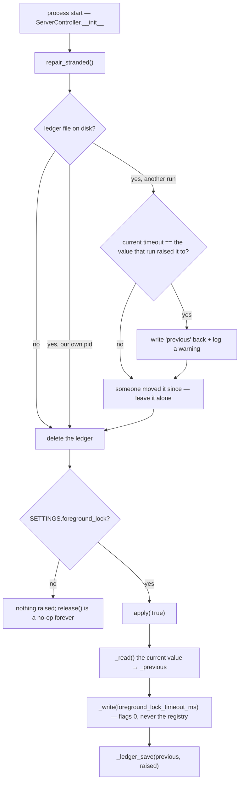
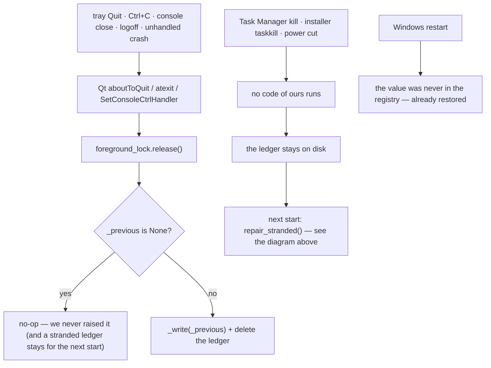
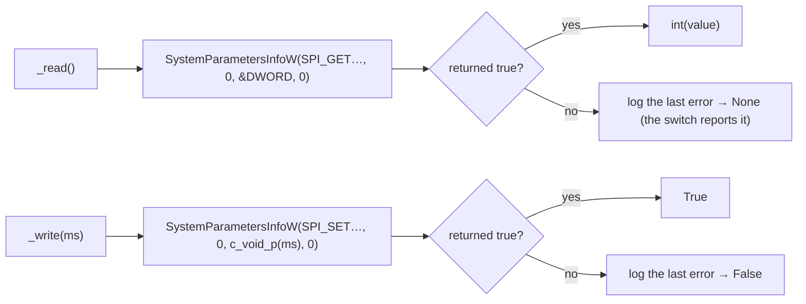

# Foreground Lock — Flow

**About:** [description](../__about/foreground_lock.md)

## Algorithm — the whole life of a borrowed machine setting

The switch in the Settings window enters at `apply(on)` and leaves the same
way; nothing else in the app touches the setting.

## Algorithm — the way out, one net per way the process can end

`release()` is wired into BOTH entry points and is idempotent, so the three
overlapping nets can all fire on one exit without doing anything twice.
It is NOT wired into `ServerController.release_windows()`: that runs on every
server stop, including Apply & restart, and dropping the lock there would
silently switch the owner's setting off in the middle of a session.

## Algorithm — one Win32 call, twice

The SET call carries its value in `pvParam` cast to a pointer — that is this
particular SPI's documented convention, not a trick. The final `0` is the
flag word, and it is the whole safety story: `SPIF_UPDATEINIFILE` would
persist the change past our process.
