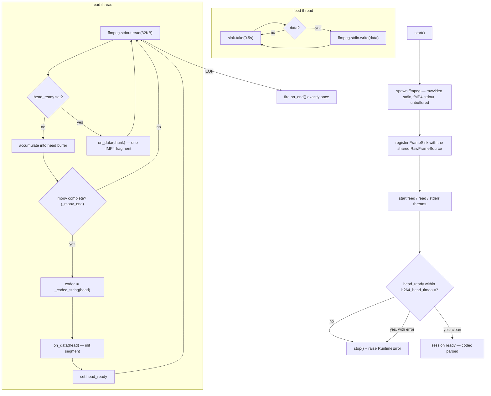
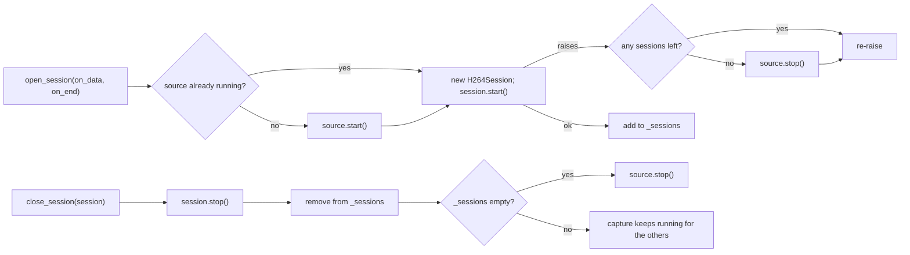

# H.264 Streamer — Flow

**About:** [description](../__about/h264_streamer.md)

## Algorithm — one H264Session

Pseudocode:

    H264Session.start():
        spawn ffmpeg (rawvideo bgr24 stdin -> fMP4 stdout, unbuffered pipes)
        register this session's FrameSink with the shared RawFrameSource
        start feed_loop, read_loop, stderr_loop threads
        WAIT for head_ready (up to h264_head_timeout)
        IF timed out OR head_error -> stop(), raise RuntimeError

    feed_loop():                       # newest frame -> ffmpeg stdin
        WHILE running:
            data = sink.take(0.5s)     # None on stall -- re-checks running and loops
            IF data -> write to ffmpeg.stdin (BrokenPipe/OSError -> normal shutdown, break)

    read_loop():                       # ffmpeg stdout -> on_data, in two phases
        head = b""
        WHILE running:
            chunk = ffmpeg.stdout.read(32KB)
            IF chunk is empty (EOF):
                IF head never completed -> head_error = "no init segment"; set head_ready
                RETURN
            IF head_ready already set:
                on_data(chunk)                       # phase 2: forward every fragment
                CONTINUE
            head += chunk                            # phase 1: accumulate the init segment
            end = _moov_end(head)
            IF end == 0 -> CONTINUE                   # moov not complete yet
            codec = _codec_string(head[:end])
            on_data(head)                            # init segment (+ any fragment already read)
            set head_ready
        FINALLY: fire on_end() exactly once

    stop():                            # idempotent, any thread, fast
        running = False
        detach sink from the source
        close ffmpeg.stdin, terminate the process
        # daemon threads unwind on their own; read_loop's EOF fires on_end

## Algorithm — H264Manager session lifecycle

