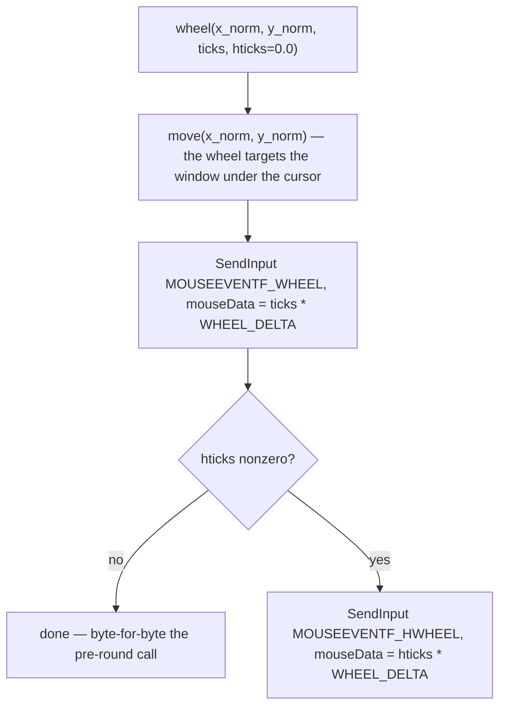
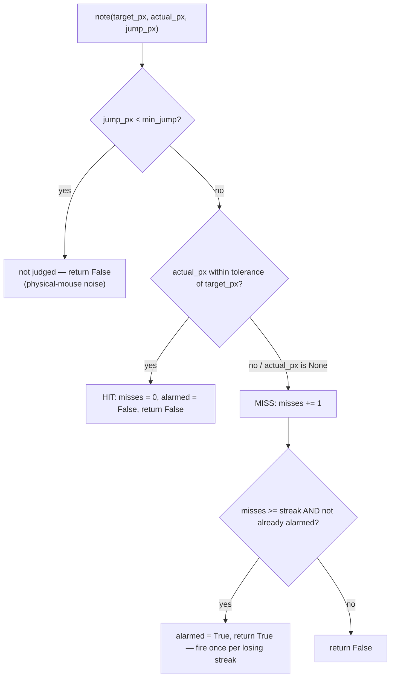
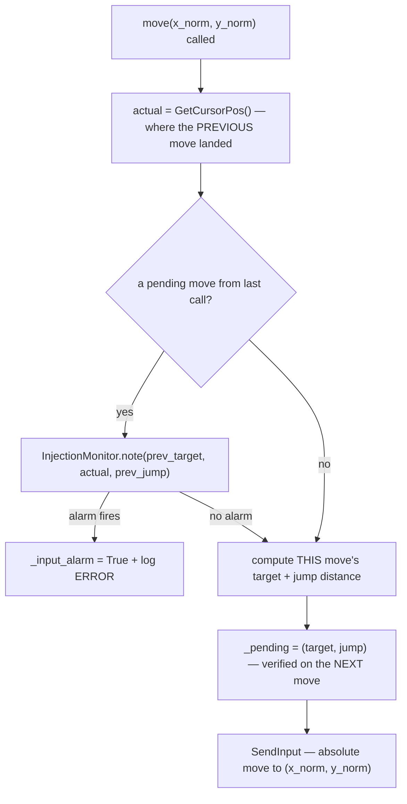
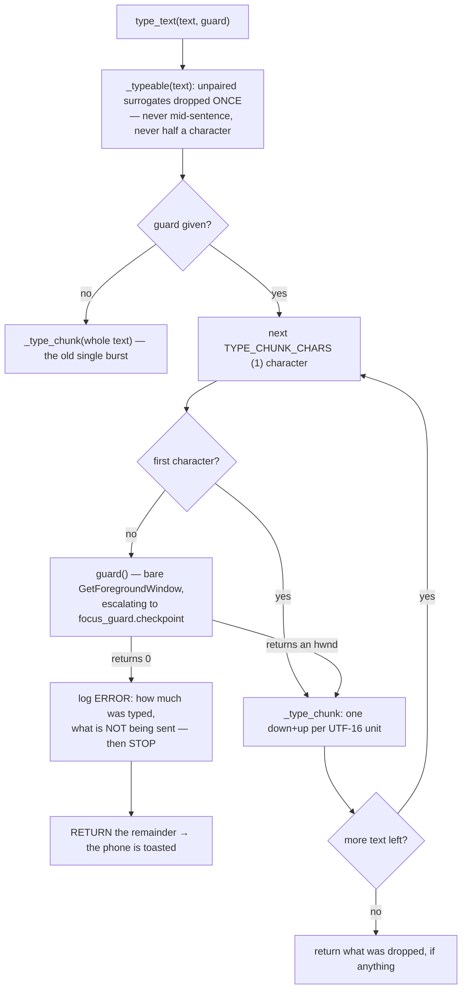

# Input Injector — Flow

**About:** [description](../__about/input_injector.md)

## Algorithm — wheel() (vertical + horizontal, owner spec 2026-08-07)

Pseudocode:

    wheel(x_norm, y_norm, ticks, hticks = 0.0):
        move(x_norm, y_norm)                              # cursor first — the wheel targets what's under it
        SendInput(MOUSEEVENTF_WHEEL, mouseData = round(ticks * WHEEL_DELTA))
        IF hticks:
            SendInput(MOUSEEVENTF_HWHEEL, mouseData = round(hticks * WHEEL_DELTA))

`hticks` defaults to 0.0 and is skipped entirely when falsy — an old call
(every caller before this round) or a `scroll` message with no `hticks` field
therefore injects EXACTLY the one WHEEL event it always did, with no HWHEEL at
all. Sign: positive `hticks` sends `MOUSEEVENTF_HWHEEL` a positive mouseData,
which Windows documents as "the wheel was tilted to the right" — the caller
(the gamepad's right stick, `client/gamepad.js`) carries its own `rx` straight
through unflipped, because Android's `AXIS_Z`/`AXIS_RX` already agrees with
that sense (unlike the Y axes, which Android reports inverted and the vertical
tick negates before it ever reaches this module).

## Algorithm — InjectionMonitor (pure decision logic)

## Algorithm — move()'s lazy verification

Pseudocode:

    move(x_norm, y_norm):
        actual = GetCursorPos()                    # where the PREVIOUS commanded move landed
        IF a previous move is pending:
            IF InjectionMonitor.note(prev_target, actual, prev_jump) → fires:
                _input_alarm = True
                log ERROR "input is being discarded by Windows (UIPI)"
        target = monitor_rect mapped from (x_norm, y_norm)
        jump = distance(target, actual)             # 0 if actual is unavailable
        _pending = (target, jump)                   # verified lazily on the NEXT move
        SendInput: absolute move to (x_norm, y_norm)

    InjectionMonitor.note(target_px, actual_px, jump_px):
        IF jump_px < min_jump → not judged (ambiguous: physical mouse / rounding noise)
        hit = actual_px is not None AND within tolerance of target_px
        IF hit → reset miss streak, re-arm the alarm, return False
        ELSE → miss streak += 1
               IF streak reached AND not already alarmed → alarm once, return True
               ELSE → return False

## Algorithm — type_text: the text is cut, and the target re-checked between cuts

Pseudocode:

    type_text(text, guard = None) -> what never reached the PC:
        text, dropped = _typeable(text)      # unpaired surrogates, once, up front
        IF guard is None → inject the whole text, exactly as before
        FOR start IN 0, 1, 2, ...:
            IF start > 0 AND guard() == 0:
                log ERROR "ABORTED after {start} of {len} characters — NOT sent: …"
                RETURN text[start:] + dropped     # a thief is never fed
            inject text[start]               # one down+up per UTF-16 code unit
        RETURN dropped

Why a check per character: `SendInput` has no target, and typing was MEASURED
on the owner's PC at 921 µs per keyboard event — ~1.84 ms per character, so a
600-character dictated sentence is ~1.1 s of injection during which a window
that steals focus receives the rest, silently, with nothing to replay it (owner
report 2026-08-06; the fix is build round R1). Against that, one
`GetForegroundWindow` costs 194 ns — 0.01% — so there is no reason to let a
thief have even one character. Why by CHARACTER and not by code unit: a
boundary inside a surrogate pair would cut an emoji in half.

Why the surrogate check happens once, up front: doing it per chunk raised
`UnicodeEncodeError` out of the middle of a sentence — part typed, the rest
gone, and the exception escaping into the WebSocket dispatcher, which catches
only `WebSocketDisconnect`. The socket died mid-dictation.

Why the guard is an ARGUMENT and not an import: the focus fence knows about
layouts and connections, which live a layer above this module. Importing upward
to reach it would invert the layering; a callable passed in costs nothing and
keeps this module knowing only how to press keys.

Why verify the PREVIOUS move instead of the current one: checking immediately would
race Windows' own cursor-update latency (a real move has not "landed" yet the instant
`SendInput` returns). Deferring the check to the next `move()` call gives Windows a
full inter-move interval to settle — without ever sleeping on the hot path.
