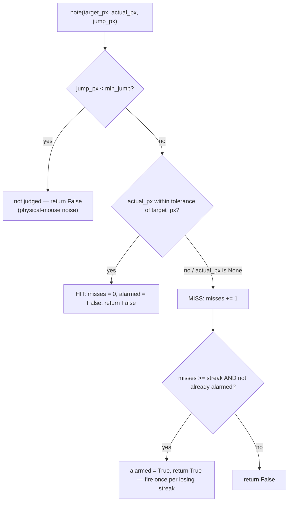
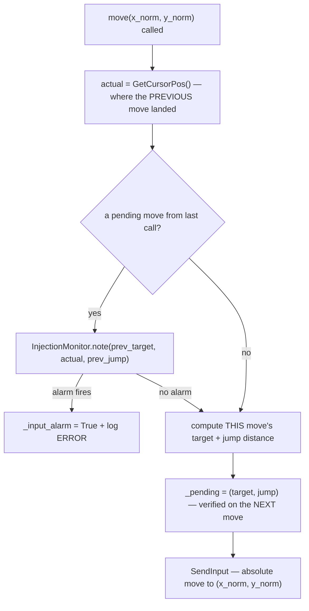

# Input Injector — Flow

**About:** [description](../__about/input_injector.md)

## Algorithm — InjectionMonitor (pure decision logic)

## Algorithm — move()'s lazy verification

Pseudocode:

    move(x_norm, y_norm):
        actual = GetCursorPos()                    # where the PREVIOUS commanded move landed
        IF a previous move is pending:
            IF InjectionMonitor.note(prev_target, actual, prev_jump) → fires:
                _input_alarm = True
                log ERROR "input is being discarded by Windows (UIPI)"
        target = monitor_rect mapped from (x_norm, y_norm)
        jump = distance(target, actual)             # 0 if actual is unavailable
        _pending = (target, jump)                   # verified lazily on the NEXT move
        SendInput: absolute move to (x_norm, y_norm)

    InjectionMonitor.note(target_px, actual_px, jump_px):
        IF jump_px < min_jump → not judged (ambiguous: physical mouse / rounding noise)
        hit = actual_px is not None AND within tolerance of target_px
        IF hit → reset miss streak, re-arm the alarm, return False
        ELSE → miss streak += 1
               IF streak reached AND not already alarmed → alarm once, return True
               ELSE → return False

Why verify the PREVIOUS move instead of the current one: checking immediately would
race Windows' own cursor-update latency (a real move has not "landed" yet the instant
`SendInput` returns). Deferring the check to the next `move()` call gives Windows a
full inter-move interval to settle — without ever sleeping on the hot path.
