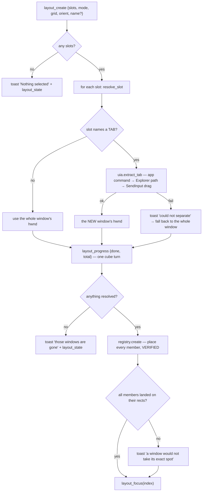
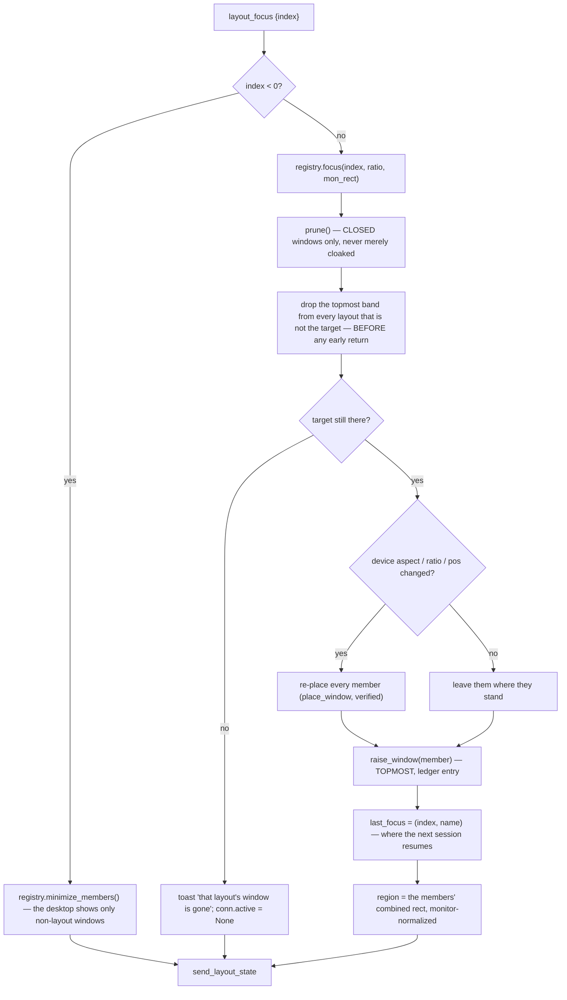

# Layout API — Flow

**About:** [description](../__about/layout_api.md)

## Algorithm — creating a layout

Every raise inside extraction is a **stage direction**, not membership: the
source window keeps its other tabs and the new window is not registered yet,
so both use `raise_window(..., topmost=False)`. A topmost raise there stranded
them — they belonged to no layout, so nothing could ever lower them again.

## Algorithm — focusing, and what leaves the topmost band

The drop pass runs **before** the early returns. It used to sit after them, so
focusing a layout whose window had been closed at the desk returned `None`
with the previous layout still nailed above everything — and the phone then
showed the desktop over it.
