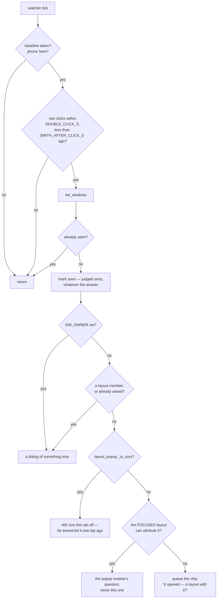
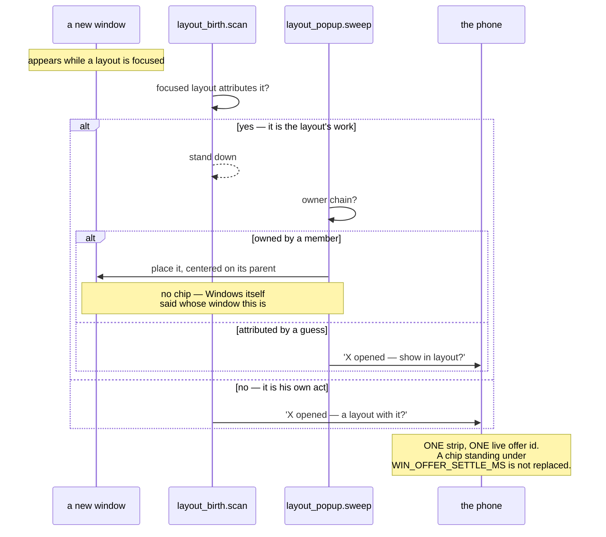

# Layout Birth — flow

[← Server index](../___server.md) · [About](../__about/layout_birth.md) ·
[Source](../layout_birth.py)

## One `scan()` pass

```mermaid
flowchart TD
    A[watcher tick] --> B{baseline taken?<br/>phone here?}
    B -- no --> Z[return]
    B -- yes --> C{two clicks within<br/>DOUBLE_CLICK_S,<br/>less than BIRTH_AFTER_CLICK_S ago?}
    C -- no --> Z
    C -- yes --> D[list_windows]
    D --> E{already seen?}
    E -- yes --> Z
    E -- no --> F[mark seen — judged once,<br/>whatever the answer]
    F --> G{GW_OWNER set?}
    G -- yes --> Z2[a dialog of something else]
    G -- no --> H{a layout member,<br/>or already asked?}
    H -- yes --> Z2
    H -- no --> I{layout_popup._is_ours?}
    I -- yes --> Z3[WE tore this tab off —<br/>he answered it one tap ago]
    I -- no --> J{the FOCUSED layout<br/>can attribute it?}
    J -- yes --> Z4[the popup module's question,<br/>never this one]
    J -- no --> K[queue the chip:<br/>'X opened — a layout with it?']
```

## Where the two questions part

```mermaid
sequenceDiagram
    participant W as a new window
    participant B as layout_birth.scan
    participant P as layout_popup.sweep
    participant Ph as the phone

    Note over W: appears while a layout is focused
    B->>B: focused layout attributes it?
    alt yes — it is the layout's work
        B-->>B: stand down
        P->>P: owner chain?
        alt owned by a member
            P->>W: place it, centered on its parent
            Note over P,W: no chip — Windows itself<br/>said whose window this is
        else attributed by a guess
            P->>Ph: 'X opened — show in layout?'
        end
    else no — it is his own act
        B->>Ph: 'X opened — a layout with it?'
    end
    Note over Ph: ONE strip, ONE live offer id.<br/>A chip standing under<br/>WIN_OFFER_SETTLE_MS is not replaced.
```
