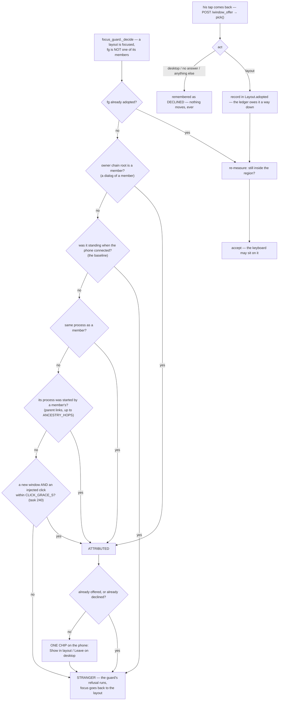
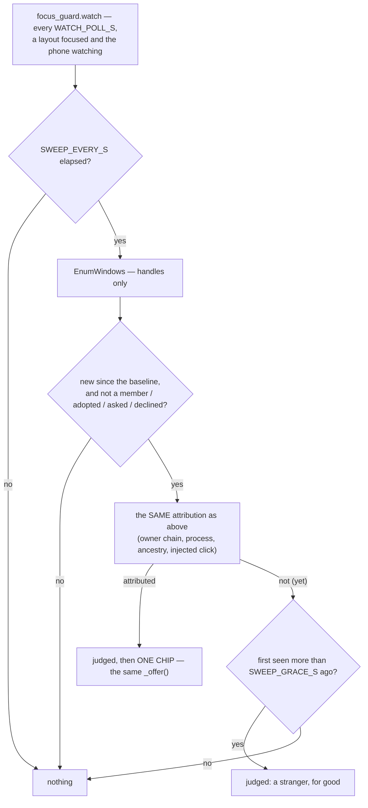
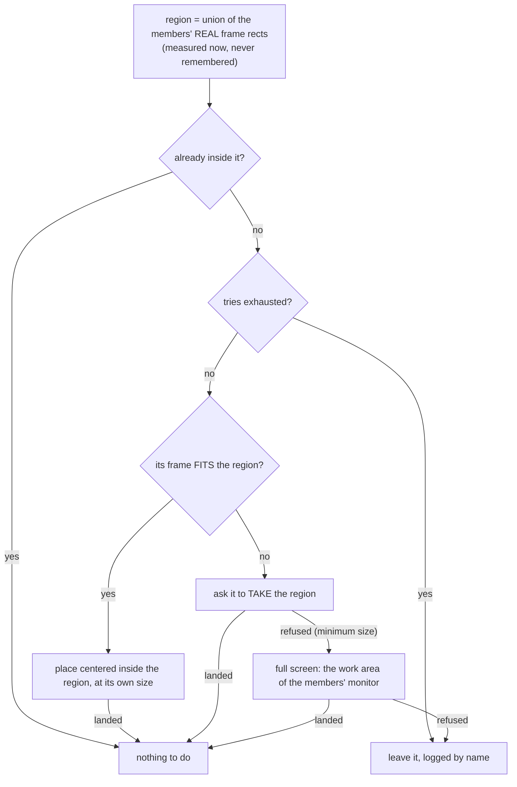
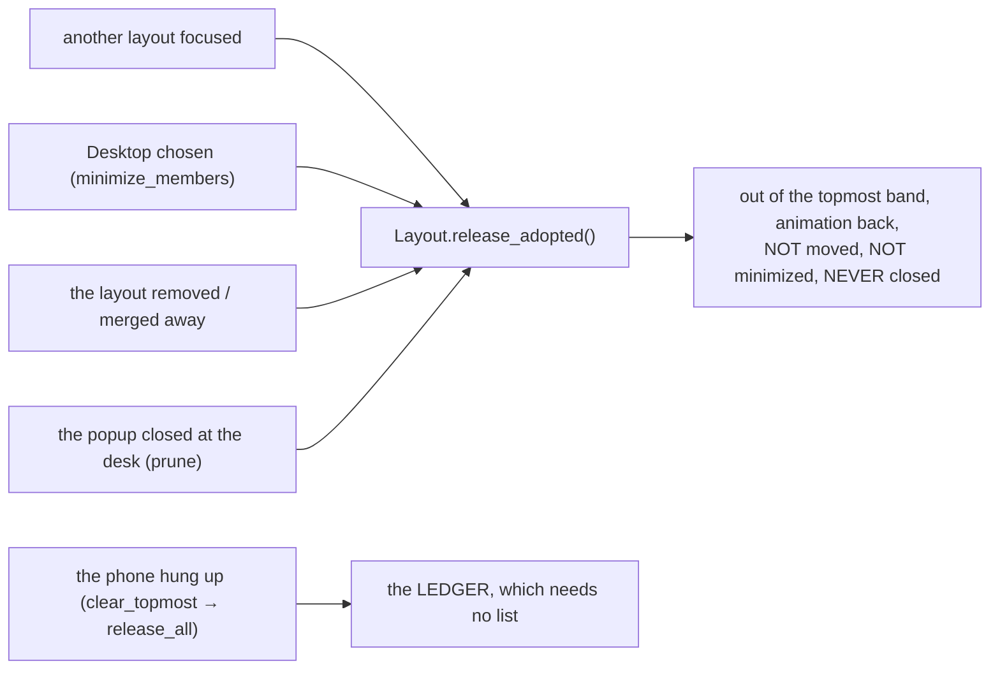

# Layout Popup — Flow

**About:** [description](../__about/layout_popup.md)

## Algorithm — a foreground window that is not a member

**Nothing moves before he taps** (his amendment, 2026-08-11): until then the
window is an ordinary desktop window and the fence treats it as one — which is
also why the offer path returns "" and the guard's refusal runs, exactly as it
did before this feature existed. The chip goes out from `focus_guard.watch`
over the page's own socket ([Notify](../__about/notify.md)'s one-device slot); his answer
comes back over HTTP, because the socket's dispatcher belongs to `web.py`.

A window is judged **once**: after the decision it joins the baseline set, so a
stranger that fights for the foreground does not cost a process-table read four
times a second, and a popup we could not place is never re-read as a thief.

**The click tier (task 240) is the LAST resort, not an extra chance for
everyone.** It only fires when a window is genuinely NEW since the baseline
AND none of the process-based rules found a tie — an already-running
third-party app opened by his click through the stream is exactly the shape
none of rules 1–3 could ever reach, because its process has no relation to any
member at all. It reuses `click_times`, the same list task 185's `note_click`
fills from every injected left click or press (`web.py`), so a click already
being tracked for one feature is what the other reads too.

## Algorithm — the sweep: it is seen WITHOUT the foreground (task 239)

His fourth report of one failure, and his own observation carried the cause:
the chip appeared only after he **left the layout and came back**. The flow
above starts at `focus_guard._decide` with the FOREGROUND — and the window
this module exists for cannot have it. It opens under the members'
always-on-top band (constraint 10); Windows refuses the foreground to a
process with no input of its own; and `watch`'s own defence hands focus back
inside the layout anyway. So the report window stood there, attributable and
unseen, until a layout switch dropped the members out of the topmost band and
it finally reached the foreground.

The sweep **moves nothing** — no raise, no placement, no foreground; the only
act is a sentence on the phone. It shares `popup_asked` / `popup_declined` /
`popup_known` with the foreground path, so a window one eye has offered can
never be offered again by the other, whichever saw it first. The grace exists
because `_judged` is permanent: a window is often visible a moment before the
thing that identifies it, and one look taken too early would make it a
stranger for the rest of the session.

## Algorithm — where it is put

Every branch goes through `window_manager.place_window`, which **verifies**
where the window really stands — the refusal is what decides the full-screen
branch, and the ledger entry (constraint 10) is made on the way.

## Algorithm — the way back down

