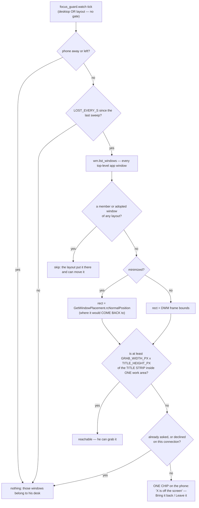
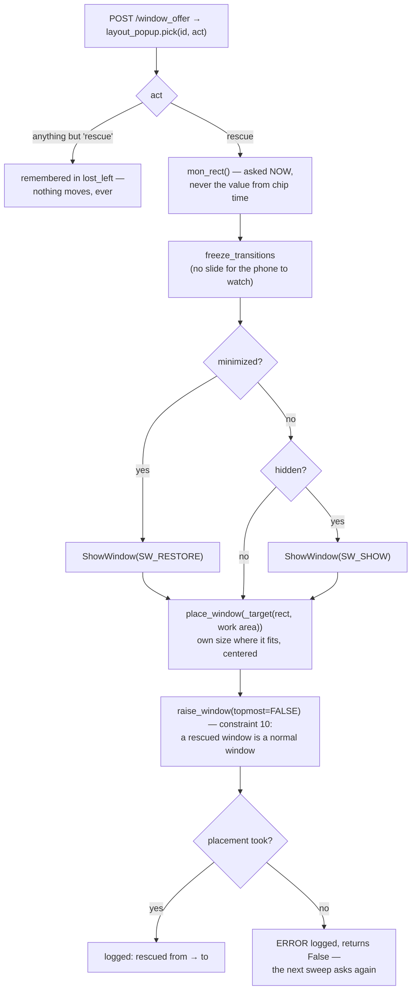

# Lost Windows — Flow

**About:** [description](../__about/lost_windows.md)

## Algorithm — is this window reachable, and how does it come back

## His tap comes back

**The order in the second diagram is the fix, not a detail.** Placing before
restoring writes the geometry into a minimized window's stored placement
without bringing it back: it returns success and he sees nothing change. The
gate pins the order (`tests/test_lost_windows.py` → *restore comes before the
placement*), proven by planting the swap.
