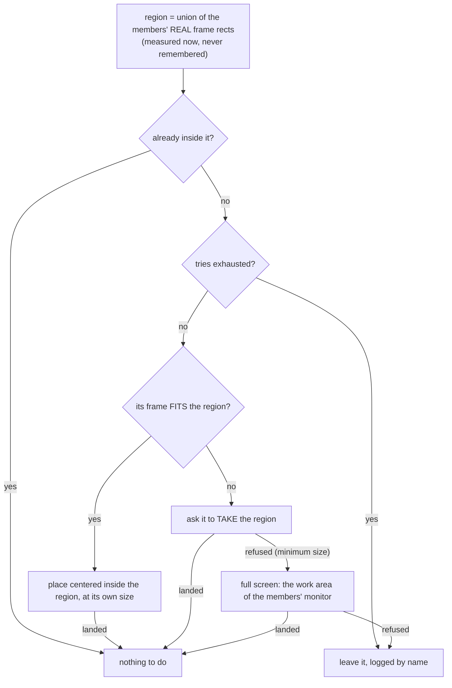
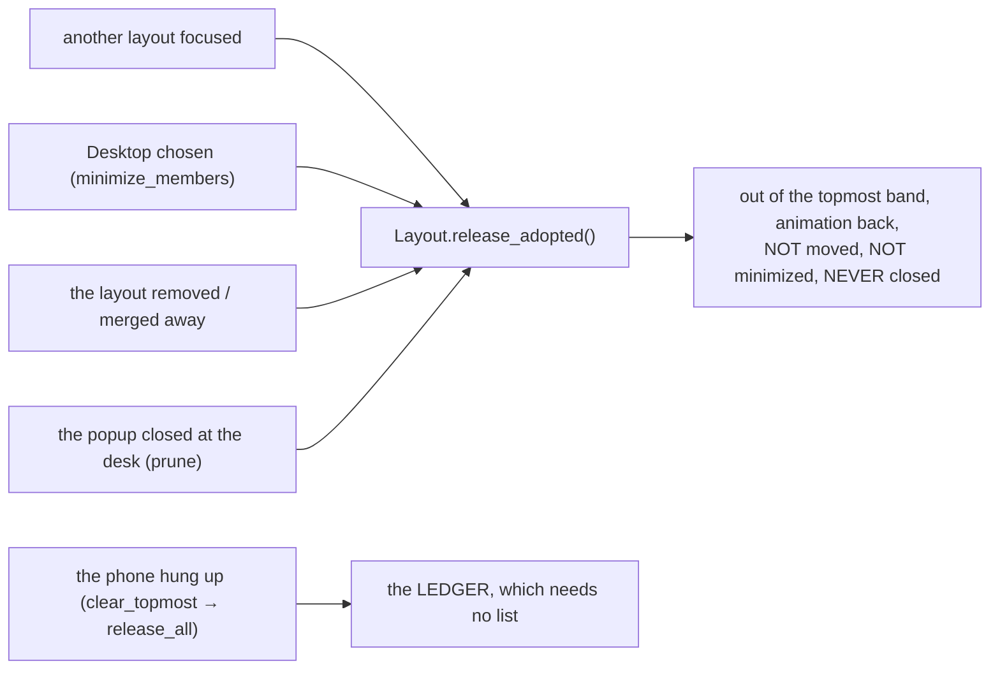

# Popup Contain - Flow

**About:** [description](../__about/popup_contain.md)

WHOSE window this is has already been decided when anything here runs -
that half is [Layout Popup - Flow](layout_popup.md).

## Algorithm — where it is put

Every branch goes through `window_manager.place_window`, which **verifies**
where the window really stands — the refusal is what decides the full-screen
branch, and the ledger entry (constraint 10) is made on the way.

## Algorithm — the way back down

