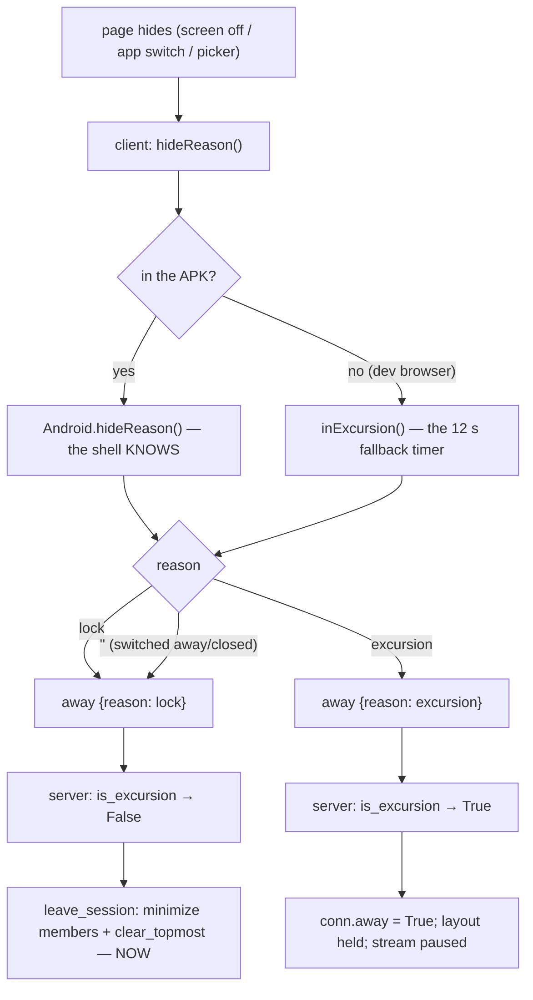
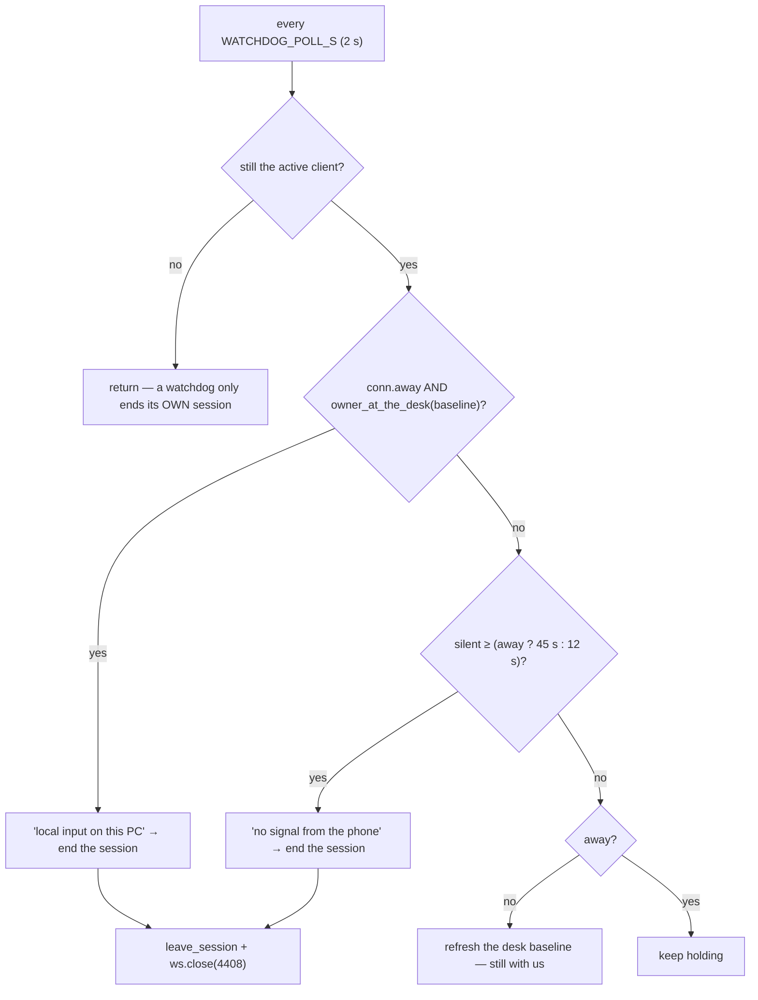
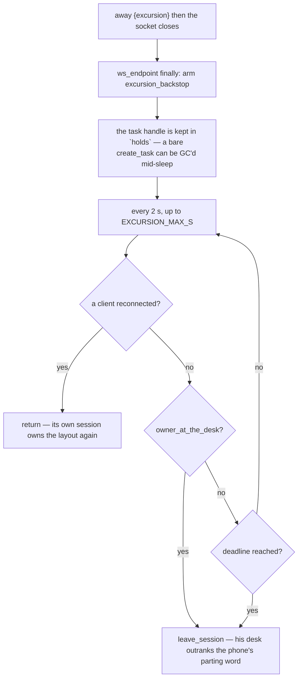

# Presence — Flow

**About:** [description](../__about/presence.md)

## Algorithm — deciding what a page-hide means

The shell answers `"lock"` whenever the screen is off or the device is locked,
and it tests that **before** its own picker flag: a picker can be open when the
screen goes off, and the screen wins.

## Algorithm — the watchdog, per connection

The baseline is refreshed on every poll while the phone is present, so at the
moment it *does* go away, "input newer than this" means the owner's own hands
and not the input we were injecting a minute ago.

## Algorithm — the hold that outlives its socket

A new authenticated socket **cancels** every armed hold. Its only test used to
be "no client connected", which is equally true in every ordinary reconnect
gap — so a stale hold could minimize the layout the owner was looking at.
