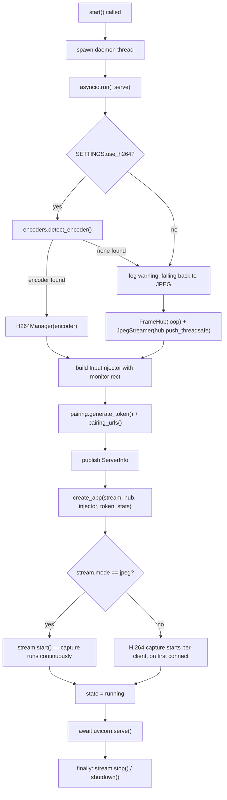

# Server Core — Flow

**About:** [description](../__about/server_core.md)

## Algorithm

Pseudocode:

    start():
        IF thread already alive → return (no-op)
        state = "starting"
        spawn daemon thread running _serve()

    _serve():
        encoder = detect_encoder() IF use_h264 ELSE None
        IF encoder found:
            stream = H264Manager(encoder)
        ELSE:
            IF use_h264 → log "no working encoder, falling back to JPEG"
            hub = FrameHub(event loop)
            stream = JpegStreamer(on_frame = hub.push_threadsafe)
        injector = InputInjector(monitor_rect_for(stream))
        token = pairing.generate_token()
        publish ServerInfo(mode, encoder, urls, token, stats)
        app = create_app(stream, hub, injector, token, stats)
        IF console_pairing → print QR to console
        IF stream.mode == "jpeg" → stream.start()   # H.264 starts per-client instead
        state = "running"
        RUN uvicorn.serve() until told to exit
        FINALLY: stop/shutdown the stream backend

    stop(timeout):
        IF stopping mid-startup → wait (up to timeout) for the uvicorn instance to exist
        SET uvicorn.force_exit = True, should_exit = True   # NOT graceful — see below
        JOIN the thread (log error if it does not stop within timeout)
        state = "stopped" (unless it was "failed")

Why `force_exit`, not graceful shutdown: a graceful stop DRAINS open connections, and a
phone watching the stream keeps its WebSocket open — the drain then waits forever, the
old thread stays bound to the port, and the next `start()` fails with "port already in
use". This was the live "Apply & restart does nothing" bug — a connected client must
never be able to hold the server hostage.
