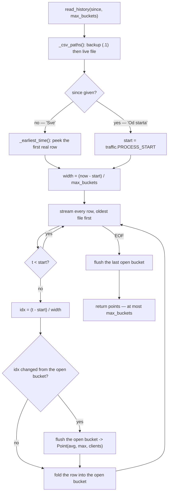
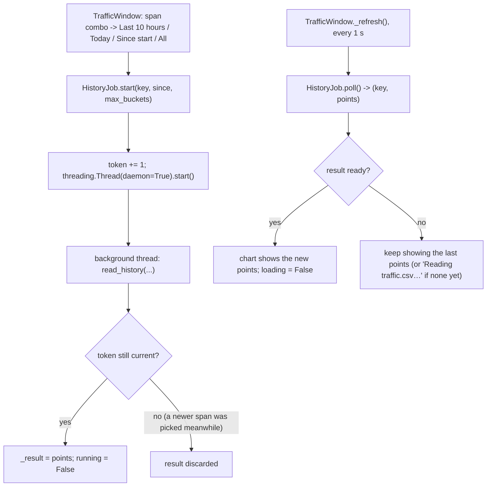

# Traffic History — Flow

**About:** [description](../__about/traffic_history.md)

## Algorithm — the streaming downsample

Pseudocode:

    paths = [backup_if_it_exists, live_file_if_it_exists]
    start = since IF since given ELSE first real timestamp in paths
    IF start is None OR now <= start: RETURN []
    width = (now - start) / max_buckets

    bucket = None   # (index, out[], in[], clients_max)
    FOR EACH row IN stream(paths):        # ONE pass, ONE line in memory at a time
        IF row.t < start: CONTINUE        # still has to be READ, just not aggregated
        idx = min(max_buckets - 1, (row.t - start) / width)
        IF bucket is not None AND idx != bucket.index:
            emit Point(bucket)            # avg + max, per direction, plus max(clients)
            bucket = None
        bucket = fold(row INTO bucket at idx)
    IF bucket is not None: emit Point(bucket)

The loop never holds more than the current open bucket beyond the output
list — memory is `O(max_buckets)`, not `O(file size)`, because CSV rows are
strictly chronological (the meter only appends) so a bucket index never goes
backwards once it has advanced.

## Algorithm — off the UI thread

Same pattern as `gui/main_window.py`'s `_run_worker`/`_guarded` — a plain
attribute under a lock, polled by the window's own timer, never a
cross-thread Qt signal.
