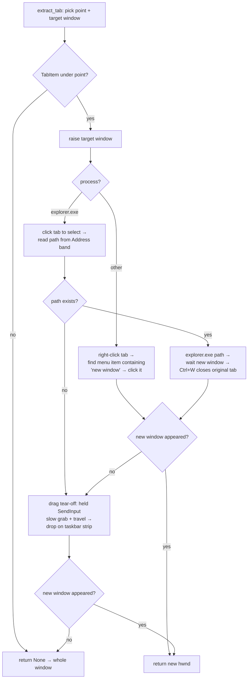

# UIA Tab Layer — Flow

**About:** [description](../__about/uia.md)

## Algorithm

Pseudocode (language-neutral):

    tab ← TabItem under the pick point (walk ancestors, ≤6 levels)
    IF no tab → None (caller uses the whole window)
    raise the target window
    snapshot ← same-process top-level windows
    IF process is Explorer:
        click tab (select) → read Address-band path → open new window there
        IF new window appeared → Ctrl+W on original tab → DONE
    ELSE:
        right-click tab → menu item with "new window" in its name → click
        IF new window appeared → DONE
    drag tab (held SendInput, slow 40px grab, then travel)
        to the taskbar strip (outside every window rect) → release
    IF new window appeared → DONE, ELSE → None

Waiting for the new window = polling the same-process window set against the
snapshot, 0.25 s steps, 6 s ceiling.
