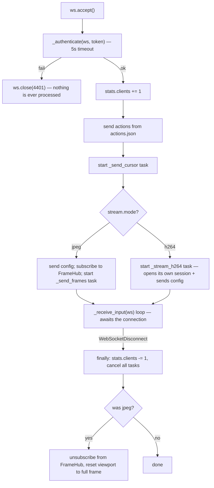
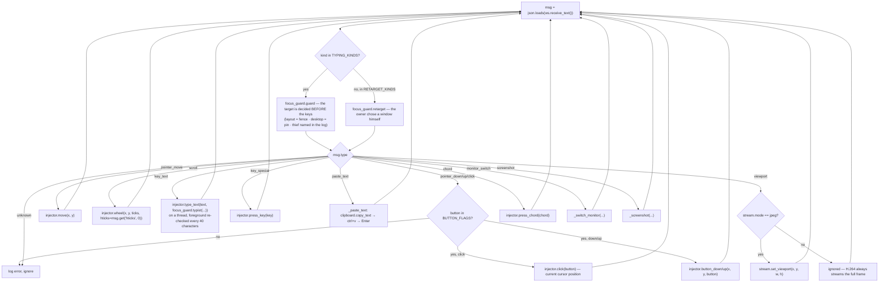
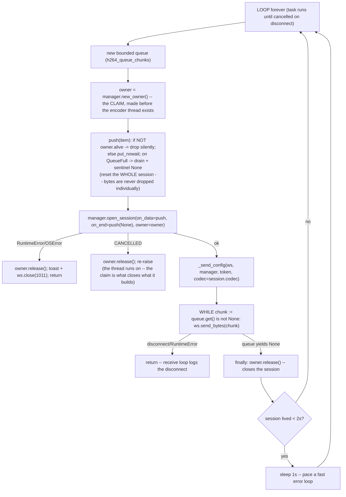

# Web Layer — Flow

**About:** [description](../__about/web.md)

## Algorithm — one WebSocket connection



## Algorithm — _receive_input dispatch



## Algorithm — _stream_h264 per-connection loop



Pseudocode:

    ws_endpoint(ws):
        accept the socket
        IF NOT _authenticate(ws, token) -> close(4401); return   # nothing before auth
        stats.clients += 1
        send {"type": "actions", ...} from actions.json
        start _send_cursor task
        IF stream.mode == "jpeg":
            send config; queue = hub.subscribe(); start _send_frames(queue) task
        ELSE:
            start _stream_h264 task (opens its own session, sends its own config)
        TRY: _receive_input(ws) loop forever
        FINALLY:
            stats.clients -= 1; cancel every task
            IF was jpeg: hub.unsubscribe(queue); stream.set_viewport(full frame)

    _receive_input(ws):
        WHILE True:
            msg = parse next JSON text message
            DISPATCH on msg.type to the matching injector call (see dispatch diagram)
            unknown type -> log warning, ignore

    _stream_h264(ws, manager, token):
        LOOP forever:
            queue = bounded Queue(h264_queue_chunks)
            owner = manager.new_owner()      # the claim -- see h264_streamer flow
            push(item): IF NOT owner.alive -> RETURN     # nothing reads this queue
                        put_nowait; ON QueueFull -> drain queue, put None
                        (a full queue means the client cannot keep up -- the WHOLE
                        session resets; H.264 bytes cannot be dropped individually)
            TRY: session = manager.open_session(on_data=push, on_end=lambda: push(None),
                                                quality=conn["quality"],  # phone panel overrides
                                                owner=owner)
                 # (a changed `quality` message resets the session via conn["reset_stream"];
                 #  the loop reopens here with the new fps/res/bitrate)
            EXCEPT (RuntimeError, OSError): owner.release(); toast, close(1011), return
            EXCEPT BaseException:            # cancelled -- socket death, 4409, server stop
                 owner.release(); re-raise   # to_thread cannot cancel the thread it started
            send config (with the session's parsed codec)
            WHILE (chunk := queue.get()) is not None:
                ws.send_bytes(chunk)
            FINALLY: owner.release()         # closes the session; silences push
            IF this session lived < 2s -> sleep 1s (paces a fast error loop)
            # loop reopens a fresh session automatically

## Build round R3 (2026-08-07) — themes

```
_send_config(ws, stream, token, codec)
   payload = { type, monitor_width, monitor_height, stream,
               tailscale_url, app_version, apk_version,
               base: _stream_base(stream),
               ui:   ui_config() }        <- R3: {theme, fill, colors}
   + codec (H.264 only)
```
