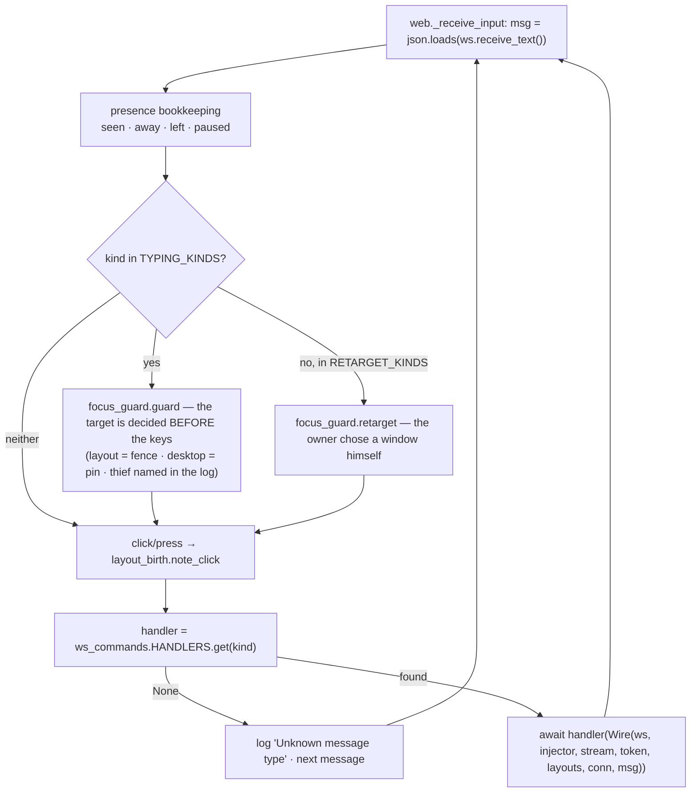
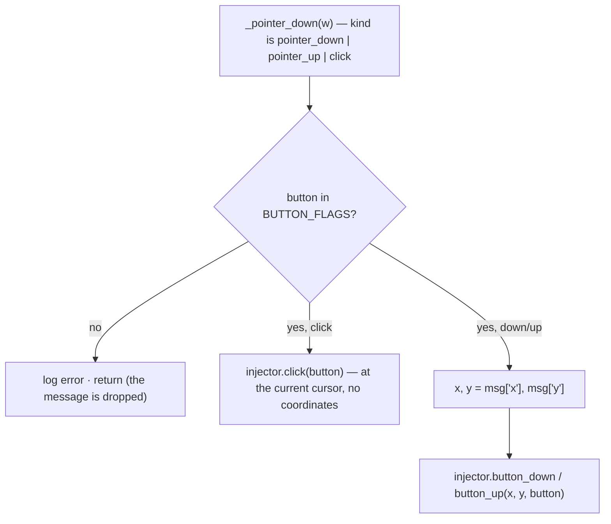

# WS Commands - Flow

**About:** [description](../__about/ws_commands.md)

The connection, the auth handshake and the send loop are
[Web Layer - Flow](web.md); this document is what happens to ONE message
after the loop has read it.

## Algorithm - a message becomes a handler call



The picture that used to live here - one `B -- kind -->` arrow per branch -
was a drawing of a chain that no longer exists. What replaced it is a lookup,
and a lookup has no shape worth drawing: the interesting half is now WHICH
handlers exist, which is the registry itself.

## Algorithm - the pointer trio, the one handler serving three kinds



Three kinds, one handler, because they are one decision about one button -
splitting them would be three copies of the same `BUTTON_FLAGS` check, which
is the duplication the registry exists to end.

## Algorithm - registration

```
@on("layout_grid")            ->  HANDLERS["layout_grid"] = _layout_grid
@on("pointer_down", "pointer_up", "click")
                              ->  all three keys, one coroutine
a kind registered twice       ->  RuntimeError AT IMPORT, never at runtime
```

The duplicate check is the property the `elif` chain could not have: a second
`elif kind == "chord"` further down the chain was simply dead code nobody
could see. Here it refuses to start the server.
