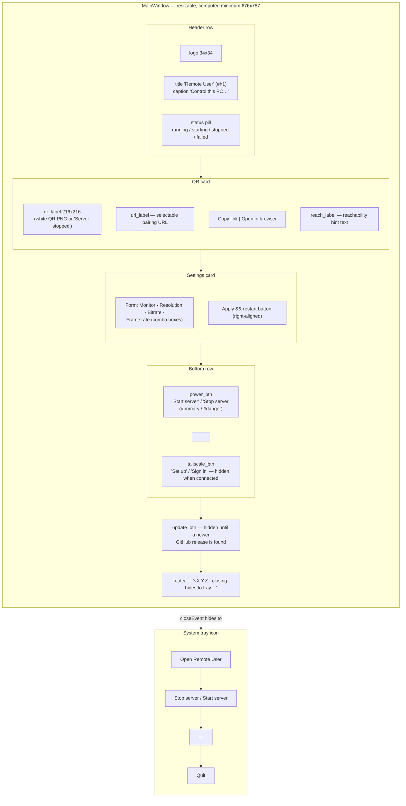

# Main Window — Flow

**About:** [description](../__about/main_window.md)

Layout sketch — the window is one column of cards, stacked top to bottom in
the exact order `__init__` adds them to `root` (a `QVBoxLayout`). This is a
zone map, not a control-flow diagram.

The column used to be pinned at a hard 400 px. It is now RESIZABLE with a
COMPUTED minimum (`_computed_minimum()` + a settle loop, THE SPACE &
LEGIBILITY LAW): the widest real row it can show — the three bottom buttons at
their longest captions, the update button's full sentence, the widest settings
row, the QR — plus the height its longest guidance text (`REACH_TEXT`) needs
once wrapped at that width. With the shipped strings that is **676 × 787**
(dev machine, Segoe UI 13 px, 2026-08-05).

Widget inventory per zone (nested-list form, for a quick text scan):

- Header
  - logo (`QLabel` pixmap)
  - titles (`QLabel#h1` + `QLabel#caption`)
  - `self.pill` (`QLabel#pill`, `state` dynamic property)
- QR card (`QFrame#card`)
  - `self.qr_label` (`QLabel#qr`, fixed 216x216)
  - `self.url_label` (selectable text)
  - `self.copy_btn`, `self.browser_btn`
  - `self.reach_label` (word-wrapped hint)
- Settings card (`QFrame#card`)
  - `QFormLayout`: `self.monitor_combo`, `self.resolution_combo`,
    `self.bitrate_combo`, `self.fps_combo`
  - `self.apply_btn`
- Bottom row
  - `self.power_btn` (`#primary`/`#danger`)
  - `self.tailscale_btn`
- `self.update_btn` (`#primary`, hidden by default)
- Footer `QLabel#caption`
- Tray (`QSystemTrayIcon` + `QMenu`)
  - open action, `self.tray_toggle`, separator, quit action
