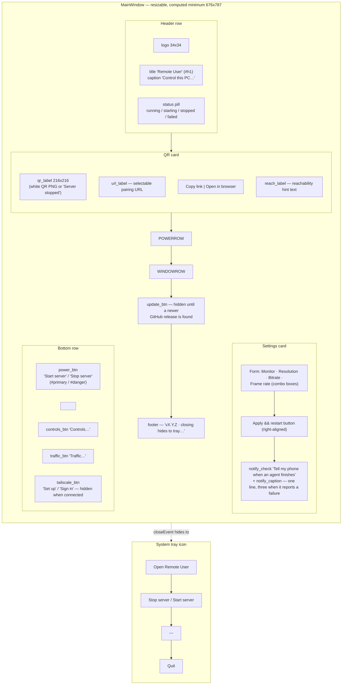

# Main Window — Flow

**About:** [description](../__about/main_window.md)

Layout sketch — the window is one column of cards, stacked top to bottom in
the exact order `__init__` adds them to `root` (a `QVBoxLayout`). This is a
zone map, not a control-flow diagram.

The column used to be pinned at a hard 400 px. It is now RESIZABLE with a
COMPUTED minimum (`_computed_minimum()` + a settle loop, THE SPACE &
LEGIBILITY LAW): the widest real row it can show — the three bottom buttons at
their longest captions, the update button's full sentence, the widest settings
row, the QR — plus the height its longest guidance text (`REACH_TEXT`) needs
once wrapped at that width. With the shipped strings that is **676 × 787**
(dev machine, Segoe UI 13 px, 2026-08-05) for the window as it is BORN.

That measurement is redone whenever the content changes (`_resettle`, and once
more on the first `showEvent`), because two zones below grow after the window
is on screen: `UPDATE` appears when the GitHub check finds a newer release, and
`NOTIFY` reports a failure in three lines where it normally speaks in one. Both
were measured only at construction until 2026-08-06, and the rows they needed
were painted over the QR card above them.



Widget inventory per zone (nested-list form, for a quick text scan):

- Header
  - logo (`QLabel` pixmap)
  - titles (`QLabel#h1` + `QLabel#caption`)
  - `self.pill` (`QLabel#pill`, `state` dynamic property)
- QR card (`QFrame#card`)
  - `self.qr_label` (`QLabel#qr`, fixed 216x216)
  - `self.url_label` (selectable text)
  - `self.copy_btn`, `self.browser_btn`
  - `self.reach_label` (word-wrapped hint)
- Power row
  - `self.power_btn` (`#primary`/`#danger`)
  - `self.tailscale_btn` (hidden once Tailscale is connected)
- Window row (round R2) — three buttons of equal stretch, each an SVG icon
  from `theme.icon()` plus a bare name: Controls, Traffic, Settings. The
  stream form and the agent-hook switch that used to sit above this row now
  live in the [Settings window](../__about/settings_window.md).
- `self.update_btn` (`#primary`, hidden by default)
- Footer `QLabel#caption`
- Tray (`QSystemTrayIcon` + `QMenu`)
  - open action, `self.tray_toggle`, separator, quit action

## Build round R3 (2026-08-07) — themes

```
MainWindow.__init__
   |- theme.apply_theme(SETTINGS.ui_theme)      <- the APPLICATION, not this window
   |- _build_header()
   |     logo . titles . -stretch- . pill . ThemeSwitch
   |                                        picked --> switch.choose_theme
   |- _build_qr_card() ... _build_window_row()
   |     each door button: setProperty("iconName", name)
   |        `- so apply_theme can rebuild it in the new ink
   `- _settle_minimum()
         inner = max(QR_SIZE,
                     power_row  - card_pad,
                     window_row - card_pad,
                     update_row - card_pad,
                     header_row - card_pad)   <- NEW in R3
         header_row = 34 + 10 + widest(title, subtitle)
                      + widest(PILL_TEXT) + 28 + 10 + THEME_SWITCH_W
```
