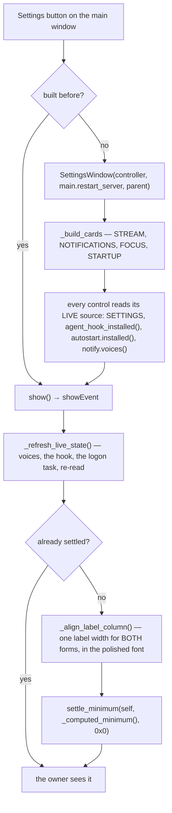
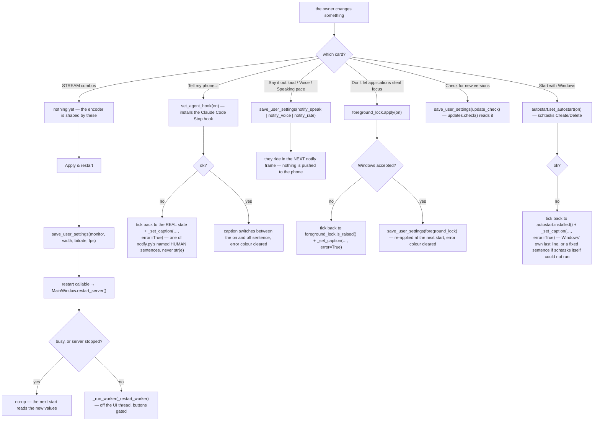
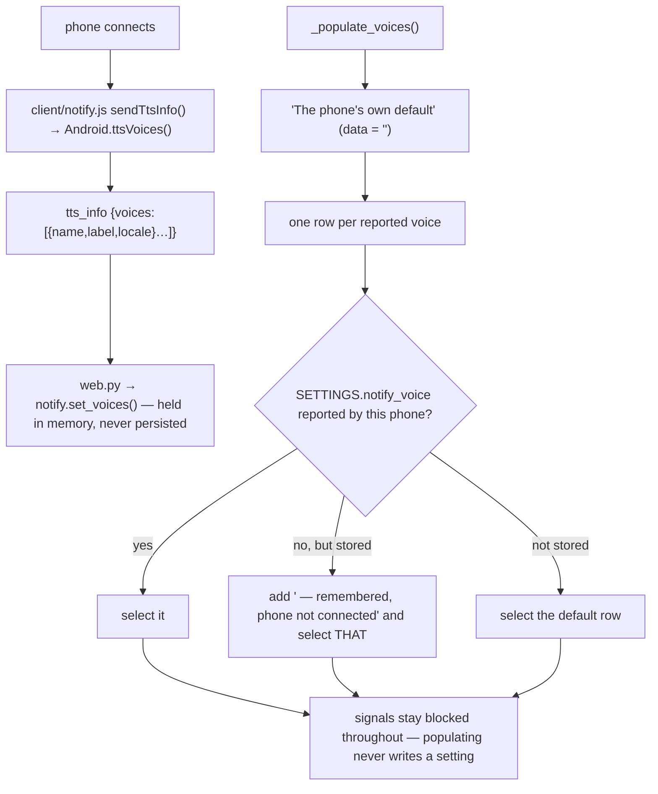

# Settings Window — Flow

**About:** [description](../__about/settings_window.md)

## Algorithm — opening the window



`_refresh_live_state()` runs on every show, not only the first: a phone may
have connected since (new voices), and an installer run may have created or
removed the logon task behind our back.

## Algorithm — what a change does



Every switch that can be REFUSED puts its tick back from the real state and
says why, in the theme's semantic Error colour (`_set_caption`, round R2's
second independent grader — see `__about/settings_window.md`). None of them
writes a setting the machine did not accept, and none of them ever shows the
raw text of an exception — that is what would turn this window into the thing
it exists to replace: a preference that only pretends, or a stack trace where
a sentence should be.

## Algorithm — the Voice dropdown, and why it cannot lose a choice



The list is never persisted on the PC: a list read from a phone that is no
longer here would offer the owner voices he cannot hear. The CHOICE is
persisted, as a plain name — a device that no longer has it falls back to its
own default rather than speaking in whichever voice now sits at that index.

## Build round R3 (2026-08-07) — themes

```
_build_cards(root)
   |- APPEARANCE          +-------------------------------------------+
   |                      | APPEARANCE            This PC   [ (  * ) ]|
   |                      | The phone   [Dark  v] [Outlined v]        |
   |                        Dark | Light | Colored dark | Colored light
   |                      | Colored gives every set its own colour -  |
   |                      | dark shades on a dark page, strong ones.. |
   |                      +-------------------------------------------+
   |- STREAM              (unchanged — the only card with an Apply)
   |- NOTIFICATIONS       (unchanged)
   `- QHBoxLayout         +------------------+ +----------------------+
         FOCUS   | 1      | FOCUS            | | STARTUP              |
         STARTUP | 1      | [ ] Don't let .. | | [x] Check for new .. |
                          | While this is on | | [x] Start with Win.. |
                          +------------------+ +----------------------+
                             ^ the reflow that kept the window inside
                               the declared 1000 px height floor
```

Minimum, measured in both palettes:

```
            width           height
before R3   614             890     (four cards, one column)
+ card      614            1048     <- past the declared 1000 floor
+ reflow    718             921     <- FOCUS | STARTUP on one row
```
