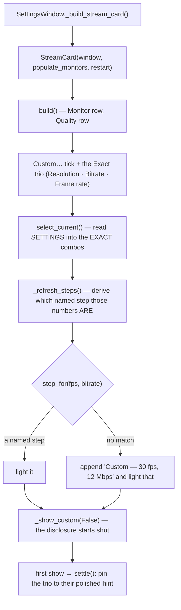
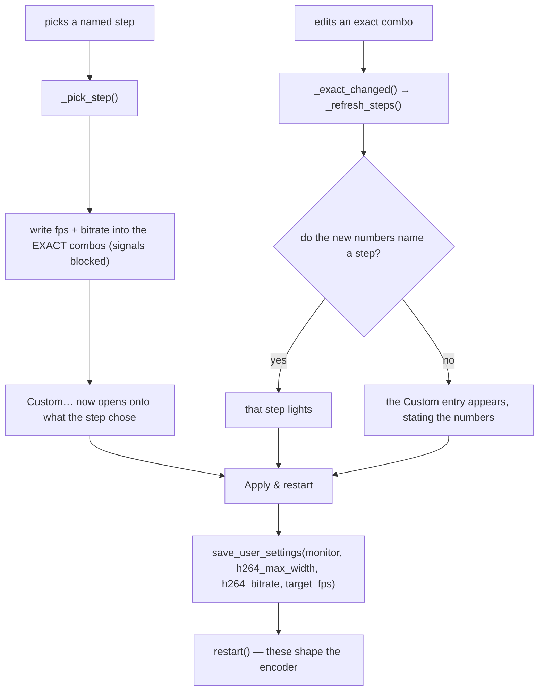
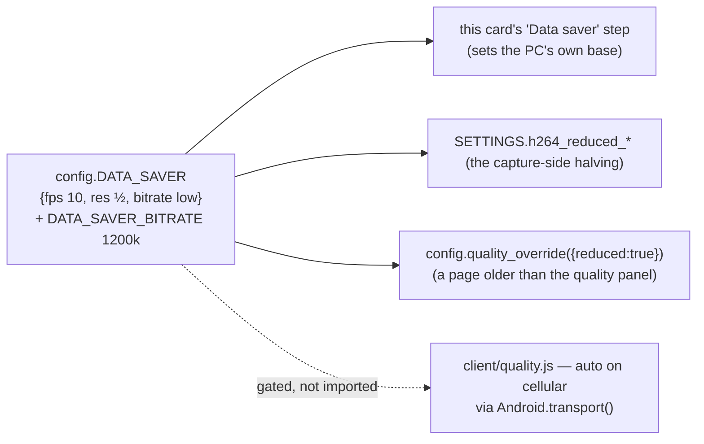

# Stream Card — Flow

**About:** [description](../__about/stream_card.md)

## Algorithm — building the card, and keeping the dropdown honest

The exact combos are **the model**; the Quality dropdown is a **view** of them. That direction is the whole design: it is why a step can never advertise numbers it does not set, and why there is exactly one save path.

## Algorithm — the two ways the owner changes it

`_pick_step` blocks the combos' signals while it writes, or every step pick would bounce straight back through `_exact_changed` and re-derive the step it just set. It deliberately touches **only** fps and bitrate: the resolution is behind Custom… and a named step must never move it.

## The one profile

Four doors, one table. The dotted edge is the one that cannot be an import — it is another language — so `tests/test_stream_card.py` reads the literal out of `client/quality.js` and asserts it against `DATA_SAVER`. That is what makes the owner's condition ("connect Data saver to mobile data, the mechanic we already have") a mechanical fact instead of a promise.
