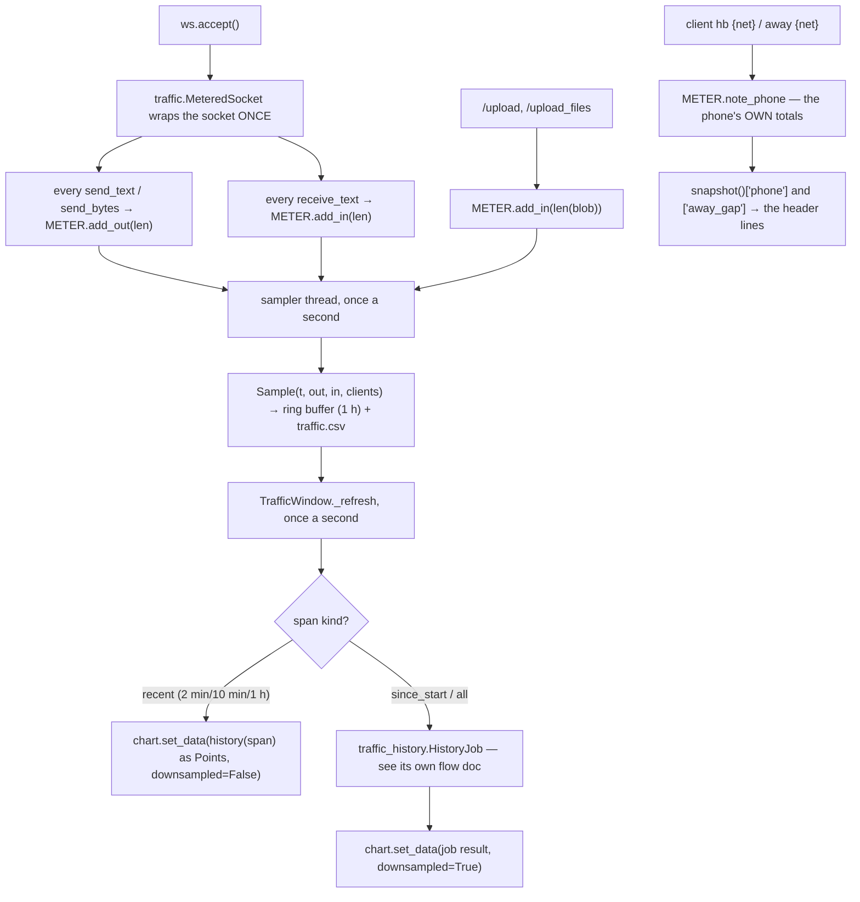
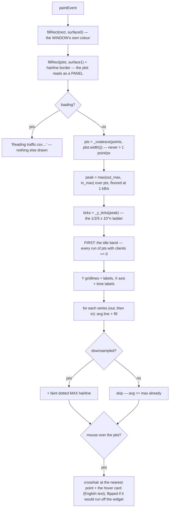
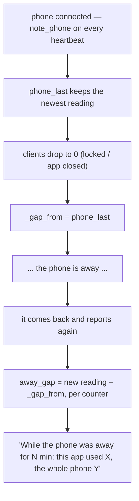

# Traffic Window — Flow

**About:** [description](../__about/traffic_window.md)

## Algorithm — one byte, from the socket to the graph



The long spans do not read `traffic.csv` on this same tick — `_maybe_start_
history` only (re)starts the background job when the span just changed or
the 30 s refresh interval elapsed; every other tick just polls for a result
that may not be ready yet.

## Algorithm — painting one frame



Below the chart, `_LegendMark` (a small `QPainter` widget, not a `QLabel`
full of glyph characters) draws the legend's four swatches and the
recording-status dot — each reading its colour from a `color_fn` callable at
PAINT time, exactly like `out_color()` / `in_color()` above it, so a runtime
theme flip is never frozen into a stale swatch.

The idle band is drawn **behind** the lines, not over them: it is the reading
the owner came here for, so it has to be visible under whatever the lines do.
`_coalesce` runs on EVERY paint, for every span — for the two long spans it
is the thing that actually enforces "never more than one point per pixel" at
the window's current width; for the three short spans it is usually a no-op
(their point count already fits most window widths).

## Algorithm — what the away-gap line says



X is what our app spent with the screen off, counted by Android itself. Y is
what the whole phone spent in the same stretch, which is the yardstick that
tells a real leak from a phone simply being a phone.

## Build round R3 (2026-08-07) — themes

```
paintEvent
   fillRect(TOKENS["surface0"])          <- read LIVE, every frame
   idle band   _alpha(TOKENS["text2"], 26)
   gridlines   _alpha(TOKENS["text2"], 40)
   series      out_color()  <- FUNCTIONS since R3, not module QColors
               in_color()
   hover card  TOKENS["surface2"] + _alpha(TOKENS["text2"], 70)
```

## Build round R6 (2026-08-07) — independent grade fixes

```
paintEvent
   fillRect(rect, TOKENS["surface0"])    <- window background, unchanged
   fillRect(plot, TOKENS["surface1"])    <- NEW: the plot is a panel
   drawRect(plot, _alpha(text2, 35))     <- NEW: hairline panel edge
   ... unchanged from here ...

legend / status row
   _LegendMark(color_fn, kind)           <- NEW: drawn swatches, not glyphs
     kind "series" -> faded fill + solid top line, in the series' own colour
     kind "band"   -> the idle-band colour, bordered
     kind "dotted" -> a dashed line, text2
     kind "dot"    -> a filled circle, success/error (recording status)
```

See [About — Build round R6](../__about/traffic_window.md#build-round-r6-2026-08-07--the-independent-grades-six-findings)
for the full list of what each fix answers.
