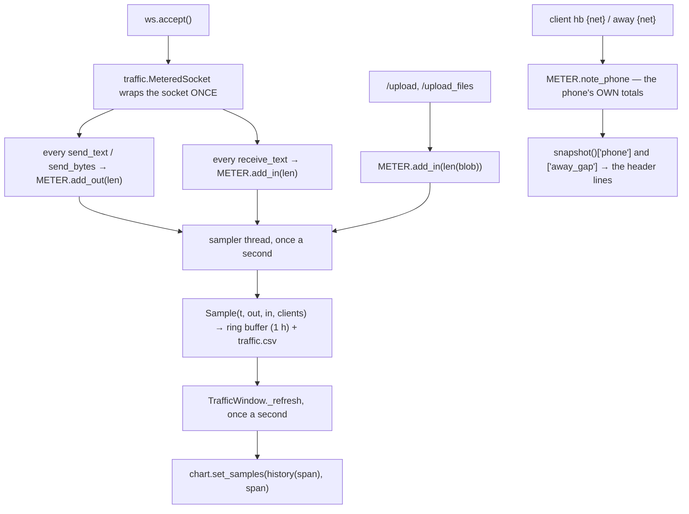
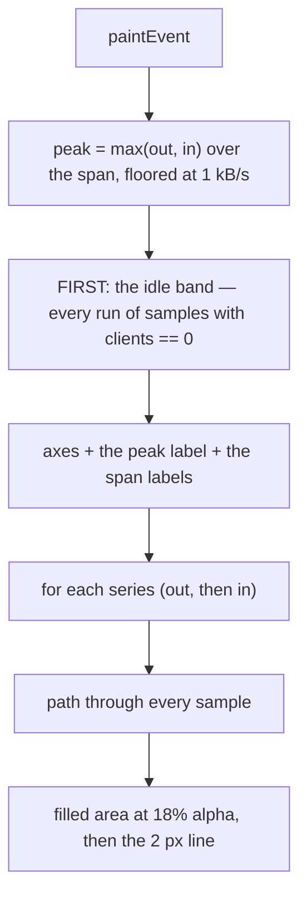
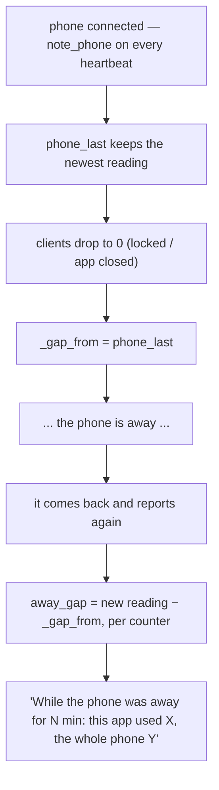

# Traffic Window — Flow

**About:** [description](../__about/traffic_window.md)

## Algorithm — one byte, from the socket to the graph

## Algorithm — painting one frame

The idle band is drawn **behind** the lines, not over them: it is the reading
the owner came here for, so it has to be visible under whatever the lines do.

## Algorithm — what the away-gap line says

X is what our app spent with the screen off, counted by Android itself. Y is
what the whole phone spent in the same stretch, which is the yardstick that
tells a real leak from a phone simply being a phone.
