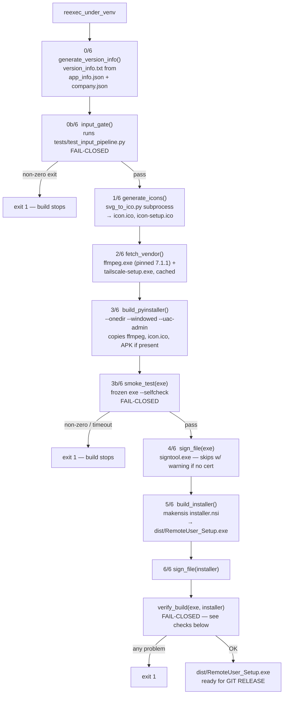

# Build Orchestrator — Flow

**About:** [description](../__about/build.md)

## Pipeline

Maps onto root SHIP.md's 7-step pipeline (SVG→ICO, Version Info, PyInstaller,
Sign EXE, NSIS Installer, Sign Installer, Verify) with two project-specific
fail-closed gates inserted — Step 0b and Step 3b (see
[about](../__about/build.md) Design Decisions for why each exists):

**Note (flagged, not fixed by this doc pass):** `main()` prints the "BUILD
COMPLETE" banner and the installer path BEFORE calling `verify_build` — so a
failing verify gate still shows "BUILD COMPLETE" in the console log
immediately before the `FAIL:` lines that follow it.

## `verify_build` — the checks

Runs LAST, after every earlier step has already claimed success. Every prior
step can fail SILENTLY (PyInstaller without `--version-file` still builds;
a skipped signing step still yields a file) — this is the only gate that
reads the finished artifacts instead of trusting that the recipe ran:

    company, file_version = read the exe's VersionInfo (via PowerShell)
    IF company != company.json's company_name: record a problem
    IF app_info.json's version is NOT a substring of file_version:
        record a problem
    IF both the certificate and its password file exist:
        FOR EACH of (exe, installer):
            status = Get-AuthenticodeSignature status
            IF status is empty or "NotSigned": record a problem
    IF any problems were recorded: print them all, exit 1
    ELSE: print OK (plus a "signing skipped" note when no cert is configured)

Signature checks are skipped ENTIRELY when no cert/password pair is present
— that mirrors `sign_file()`'s own unsigned-build fallback, so an
intentionally unsigned dev build doesn't fail its own verification gate.
