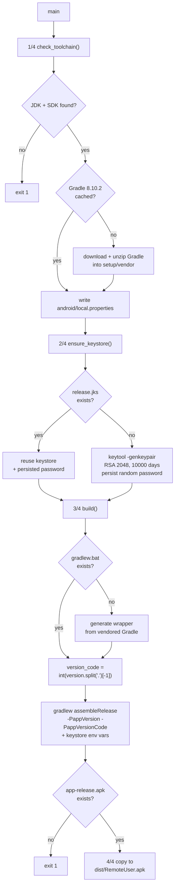

# Build APK — Flow

**About:** [description](../__about/build_apk.md)

## Algorithm

Pseudocode (language-neutral):

    check the JDK and Android SDK exist, else fail the build
    IF the pinned Gradle version is not cached: download + unzip it
    write local.properties (SDK path) so Gradle can find the SDK

    IF a release keystore already exists: reuse it + its saved password
    ELSE: generate a 2048-bit RSA keystore, persist a fresh random password

    IF the Gradle wrapper is missing: generate it from the vendored Gradle
    version_code = integer value of the LAST dot-segment of app_info.version
    run "gradlew assembleRelease" with the version + keystore env vars
    IF the expected release APK path is missing afterward: fail the build

    copy the signed APK to dist/RemoteUser.apk
