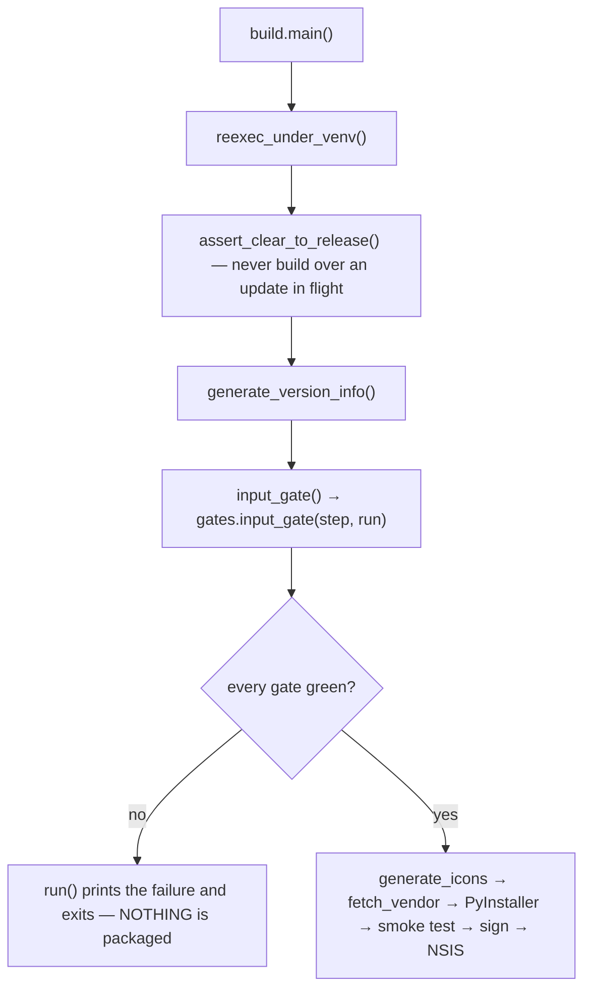
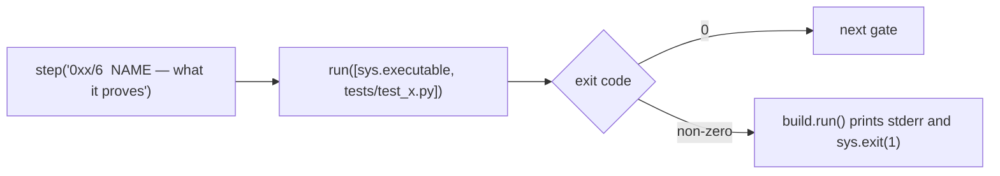

# Gates — Flow

**About:** [description](../__about/gates.md)

## Algorithm — where the suite sits in a build

The suite runs BEFORE anything is generated. A refusal must cost nothing, and a half-built `dist/` after a failed gate is an invitation to ship it by hand.

## Algorithm — one gate

Two halves, and both are load-bearing:

- **`step(...)`** is the sentence the owner reads in the build log. It names what the gate PROVES, not what it runs — a line saying `test_stream_card.py` tells him nothing when it fails at 2 a.m.
- **`run(...)`** is `build.py`'s own runner, which exits the whole build on a non-zero code. That is what makes the suite fail-CLOSED rather than advisory, and it is why the runner is passed in instead of reimplemented here.

A gate that needs a tool the machine does not have (playwright, Chromium, node) reports that as a FAILURE from inside the test itself, never as a skip.
