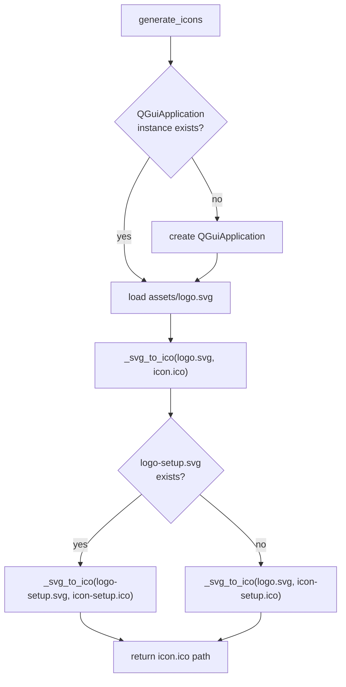
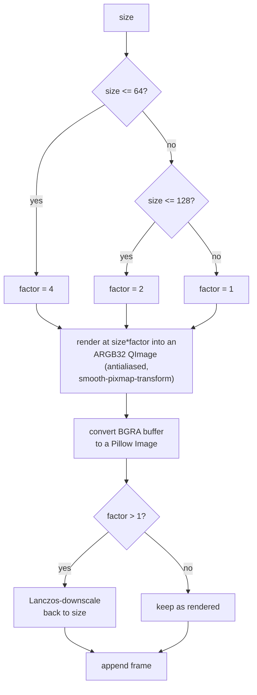

# SVG To ICO — Flow

**About:** [description](../__about/svg_to_ico.md)

## Algorithm — top level

## Algorithm — per-size render loop (inside `_svg_to_ico`)

Runs once per entry of `ICO_SIZES = [16, 32, 48, 64, 128, 256]`:

After all 6 sizes are collected, the frame list is REVERSED (largest — 256px
— first, since Windows treats the first frame in a multi-frame `.ico` as the
primary icon) and saved as one file.

Pseudocode (language-neutral):

    FOR size IN [16, 32, 48, 64, 128, 256]:
        factor = 4 IF size <= 64 ELSE 2 IF size <= 128 ELSE 1
        render the SVG at (size * factor) into an antialiased image
        convert to a bitmap image object
        IF factor > 1: Lanczos-downscale back down to size
        append the frame
    REVERSE the frame list (largest first — Windows' primary-icon rule)
    SAVE all frames together as one multi-resolution .ico file

`generate_icons()` runs this whole per-size loop TWICE — once for
`assets/logo.svg → setup/icon.ico`, once for `assets/logo-setup.svg` (or
`logo.svg` as fallback when no setup-specific variant exists)
`→ setup/icon-setup.ico`.
